Eyegrade User Manual
====================

:Author: Jesús Arias Fisteus

.. contents::
.. section-numbering::

This is the user manual for Eyegrade 0.9.
Versions of this manual for earlier releases
are available:
`0.8 <../user-manual-0.8>`_,
`0.7 <../user-manual-0.7>`_,
`0.6 <../user-manual-0.6>`_,
`0.5 <../user-manual-0.5>`_,
`0.4 <../user-manual-0.4>`_,
`0.2 <../user-manual-0.2>`_.

Installing Eyegrade
-------------------

Installation on GNU/Linux
.........................

We propose several ways to get Eyegrade running,
so that you can choose the one that better fits your needs
and experience in Linux systems:

- Install in binary format from a tarball file.

- Install through `pipx` within your user's account.

Both are described below.
The first alternative is somewhat easier,
since it doesn't require you to install any other software,
but has the disadvantages that Eyegrade may take longer to startup
or, on rare occasions, might fail to start on your Linux system.
The second alternative, `pipx`,
requires your system to have Python 3.6 or 3.7 installed.
The installation procedure is a little bit more complex,
but in our opinion it's totally worth it
if you already have Python 3.6 or 3.7.

Installation in binary format from a tarball file
~~~~~~~~~~~~~~~~~~~~~~~~~~~~~~~~~~~~~~~~~~~~~~~~~~

Eyegrade for Linux is distributed as a tarball file
containing the executable files
`eyegrade` (its main program)
and `eyegrade-create`
(the command line tool that creates the PDF files of the exam).
Download and uncompress the tarball file from the
`downloads page <http://eyegrade.org/download.html>`_
and save the binary files
in the location you prefer inside your account
or within a system-wide directory.
You may want to add the directory to your `PATH`
or place the binaries inside a directory that is already in your `PATH`.
For example, if you want to place the binaries
inside `/usr/local/bin`, which is usually in your `PATH`::

  tar xavf eyegrade-0.9-linux-bin.tgz
  sudo cp eyegrade-0.9-linux-bin/eyegrade /usr/local/bin
  sudo cp eyegrade-0.9-linux-bin/eyegrade-create /usr/local/bin

Installation through `pipx` within your user's account
~~~~~~~~~~~~~~~~~~~~~~~~~~~~~~~~~~~~~~~~~~~~~~~~~~~~~~~

Check that your Linux system has Python 3.6, 3.7 or 3.8 installed
by running::

  python3 --version

Several things may happen:

- The `python3` command is not found:
  look for it with your package manager
  and check that its version is 3.6 or later.
  The package is called `python3` in most Linux distributions.

- If reports a version number lower than 3.6:
  your Linux distribution does not probably package a 3.6 or later version.
  You may install Python 3.6 or 3.7
  through `pyenv <https://github.com/pyenv/pyenv>`_.

Once you have a working version of Python 3.6 or Python 3.7,
install `pipx <https://github.com/pipxproject/pipx>`_
through `pip`::

  python3 -m pip install --user pipx

If you get a message saying that there is no module named `pip`,
install the `python3-pip` package and then run::

  pip install --user pipx

The `pipx` command might now be available on your shell's PATH. Try to run::

  pipx install eyegrade

If `pipx` isn't found as a command,
you need to add `$HOME/.local/bin` to your PATH.
The `pipx` program is able to do that if you run::

  $HOME/.local/bin/pipx ensurepath

Now, try to install Eyegrade again, and it should work::

  pipx install eyegrade

That's it! You can now run Eyegrade by entering the `eyegrade` command
in a terminal::

  eyegrade

The `eyegrade-create` program will also available as a command-line program::

  eyegrade-create --version

Installation on Microsoft Windows
.................................

Download and install
`Microsoft's Visual C++ Redistributable for Visual Studio 2015
<https://www.microsoft.com/en-us/download/details.aspx?id=48145>`_.

Then,
download Eyegrade's  Windows installer
from the `downloads page <http://eyegrade.org/download.html>`_
and run it.
Once installed, Eyegrade will be accessible through your Start Menu.

**Important:**
The security systems of Windows will probably alert you
that running the installer may be dangerous
because of it coming from an untrusted source.
The reason is that being Eyegrade free software
I cannot pay for a trusted certificate
with which to sign the installer.
If you want to be sure the installer has not been tampered with by anybody,
use the checksums from the downloads page.

**Note:**
If you try to uninstall Eyegrade manually
or run the installer for a newer version,
the installer may fail with a message
saying that Eyegrade is running and should be closed first.
This message will appear also if there is any file manager window
positioned in a directory called *Eyegrade*.
Close the file manager window in that case and proceed again.

Installation on Mac OS X
........................

Unfortunately, I cannot provide support for Mac OS X.
I'm confident that Eyegrade should work on that platform out of the box
or with some minimal changes,
but I don't own a computer
in which to check and build an installer.
Volunteers to support Eyegrade on Mac OS X are welcome.

Upgrading from Eyegrade 0.8 to Eyegrade 0.9
......................................................................

In Linux systems, just replace the binaries of Eyegrade 0.8
with the new ones.
In Windows, you can uninstall Eyegrade 0.8
using the *Add/remove programs* feature.

Eyegrade 0.9 is backwards-compatible with grading sessions
created with Eyegrade 0.3 and later versions.

The main changes of the most recent versions are described in the following
blog posts:

- `Eyegrade 0.9 released
  <http://www.eyegrade.org/blog/posts/eyegrade-09-released/>`_

- `Eyegrade 0.8 released
  <http://www.eyegrade.org/blog/posts/eyegrade-08-released/>`_

- `Eyegrade 0.7 released
  <http://www.eyegrade.org/blog/posts/eyegrade-07-released/>`_

- `Eyegrade 0.6 released
  <http://www.eyegrade.org/blog/posts/eyegrade-06-released/>`_

- `Eyegrade 0.5 released
  <http://www.eyegrade.org/blog/posts/eyegrade-05-released/>`_

- `Eyegrade 0.4 released
  <http://www.eyegrade.org/blog/posts/eyegrade-04-released/>`_

- `Eyegrade 0.3 released
  <http://www.eyegrade.org/blog/posts/eyegrade-03-released/>`_

Grading Exams
-------------

If it is the first time you run Eyegrade,
it is recommended to go first through the
`Quick start guide <http://www.eyegrade.org/quick-start-guide>`_.
From now on, it is assumed that you've already done that.

The main purpose of Eyegrade is grading exams. In order to grade exams,
you will need:

- The Eyegrade software installed in your computer.
- The exam configuration file, which specifies the number of questions
  in the exam, solutions, etc. It is normally named with the
  `.eye` extension, such as `exam.eye`.
- A compatible webcam, with resolution of at least 640x480. It is
  better if it is able to focus (manually or automatically) at short
  distances.
- The list of students in your class, if you want Eyegrade to
  detect student IDs.
- The exams to grade.

Launching Eyegrade
..................

If it is the first time you use Eyegrade,
you can try it with the sample file ``exam-A.pdf``
located inside the directory ``examples`` of your installation
of Eyegrade. Print it. You'll find also in that directory the file
``exam.eye`` that contains the metadata for this exam. You'll need to
load this file later from Eyegrade.

On Windows, launch Eyegrade from the Start Menu.
On Linux, run the `eyegrade` binary file you should have installed.
Eyegrade's main window should appear:

.. image:: images/main-window.png
   :alt: Eyegrade main window

Before beginning to grade exams, especially the first time you run
Eyegrade, you can check that Eyegrade can access your webcam. In the
*Tools* menu select the *Select camera* entry:

.. image:: images/camera-selection.png
   :alt: Select camera dialog

The next step is creating a grading session. Select *New session* in
the menu *Session*. A wizard will ask for some data Eyegrade
needs for creating the session:

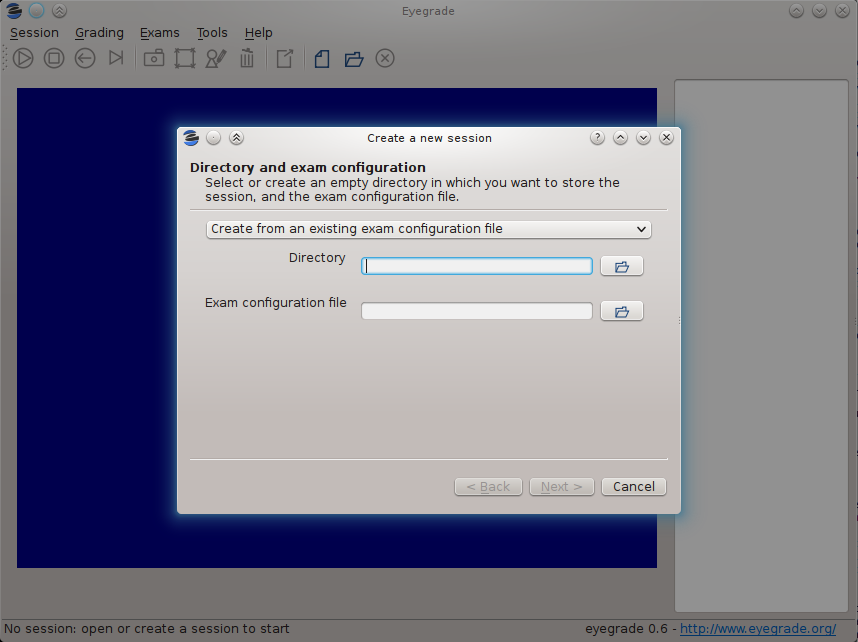

In the first step of the wizard,
you must select or create the directory where Eyegrade will store
the data (grades, captures of exams) for this grading session.
If you select an existing directory, it must be empty.
In addition,
you'll choose between loading an existing exam configuration file
or configuration the exam manually.
The configuration of the exam consists of data
such as the number of questions, the correct answers,
the geometry of the answer tables, etc.
If you use Eyegrade for editing the exam,
as explained in `Editing exams`_,
the exam configuration file will be automatically created
along with the PDF files of your exams.
If you are testing the sample exam distributed with Eyegrade,
you should load here the ``exam.eye`` file from the same directory.

If you edit the exam with other software such as Microsoft Word
(see `Creating the exams in a word processor`_),
select the option *Configure the exam manually*
and proceed as explained in `Manual configuration of the exam`_.

After you have entered the exam configuration
(either from a file or manually)
the last two steps of the wizard
will allow you to create student groups and load student lists,
as well as to enter the scores awarded to questions:

- Students: you can import student lists from your file system
  and manage student groups.
  See `Student lists`_ for more information about this feature.

- Scores for correct and incorrect answers: this step is optional. If
  you provide the scores awarded to correct answers (and optionally
  deducted from incorrect answers), Eyegrade will show the marks of
  each exam. See `Scores`_ for more information about this feature.

After you finish with this dialog, Eyegrade opens the session. It
shows the image from the webcam and starts scanning for the
exam. Point the camera to the exam until the image is locked. At this
point, Eyegrade should show the answers it has detected. Read the
following sections for further instructions.

Manual configuration of the exam
.................................

If you choose to edit your exams with a word processor
instead of using the LaTeX-based system that Eyegrade provides,
you'll need to enter the exam configuration manually.
You can enter it when you create a new session.
In the first page of the session creation wizard,
choose the option *Configure the exam manually*:

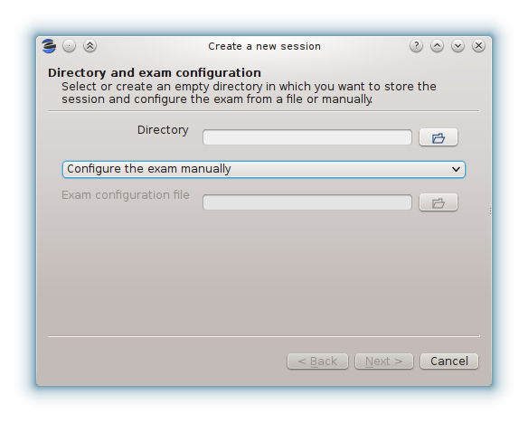

Then,
create or select an empty directory for the session
and proceed to the next page:

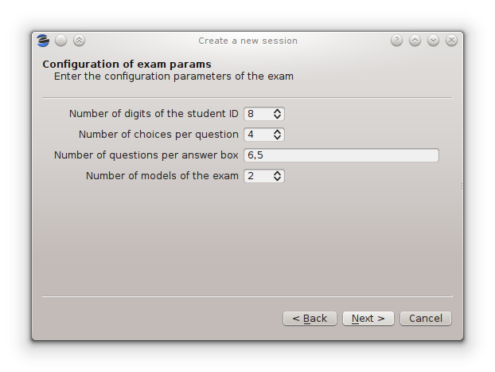

In this page,
you must enter:

- The number of digits of the student id number.
  Set it to 0 if your exams do not ask for an student id.

- The number of choices per question.
  That is, the number of alternative answers
  from which the student must select one.

- The number of questions per answer box.
  The answer sheet may contain more than one answer table,
  such as the examples shown at `Creating the exams in a word processor`_.
  Enter here the number of questions per answer table,
  from left to right.
  For example, you would enter "6,5" for the following answer table:

  .. image:: images/example-table-2.png
     :alt: Example answer tables.

- The number of models of the exam.
  If you have different permutations of your questions
  in order to make it more difficult for students
  to look at the answers of other students,
  enter here how many variations of the exam you have.
  Each variation is called a *model* in Eyegrade.
  Models are labeled "A", "B", "C", etc.

Then, proceed to the next page and enter the correct answer
for every question in every model of the exam:

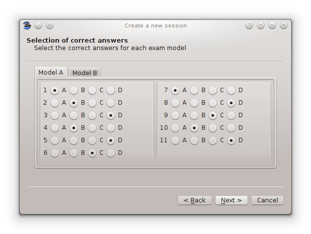

You must enter the correct answer for every question
in every exam model.
When you finish entering the data of this page,
the wizard will proceed to ask about the student list
and question scores as explained in the previous section.

If you or your collegues need to create other sessions
with the same configuration as one you've already entered,
use the option *Tools / Export exam configuration*
to export a file with the exam configuration
of the current session.
With this file you can create new sessions
with exactly the same configuration.

Student lists
...................

The accuracy in the detection of the student identity
improves dramatically when you supply
the list of ids of the students in your class,
where each student id is expected to be a sequence of digits.

Many institutions divide the students of the same course
in separate groups or classes.
Eyegrade is able to manage students in separate groups,
which will allow you to export a separate grades listing for each one.

You can manage student groups and import the lists of students
either in the *New session* wizard
or later in the *Exams / Students* menu option.
Both methods provide the same user interface.
At the beginning, a default group with no student will be shown:

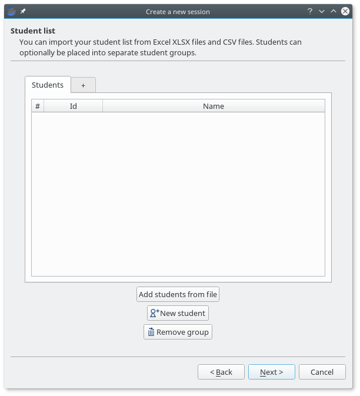

If you don't need to separate your students into groups,
just load the file or files that contain your student lists.
Student lists can be provided in Office Open XML format
(.XLSX files created from Microsoft Excel, LibreOffice
and other compatible spreadsheet software)
or in CSV (*comma-separated values*) format.
In both cases, Eyegrade will scan the first columns
and try to detect which ones store
student ids (mandatory)
and, optionally,
student names and email.
Your files may include a header line at the beginning and empty lines.
They will be ignored when detected.

Some examples of valid student lists are shown below:

- Student ids:
  just one column with the id number of the student::

    100000333
    100777777
    100999997

- Student id and full name:
  one column contains the student id number
  and the other one their full name::

    100000333    Frodo Baggins
    100777777    Bugs Bunny
    100999997    Bastian Bux

  Column order doesn't matter::

    Frodo Baggins   100000333
    Bugs Bunny      100777777
    Bastian Bux     100999997

- Separate first and last names:
  you can enter first and last names in separate columns,
  as long as they are contiguous.
  The first of them is treated as the first name by default::

    100000333	Frodo	Baggins
    100777777	Bugs	Bunny
    100999997	Bastian	Bux

  If your file provides them in the opposite order,
  you'll be able to swap them once the file is loaded::

    100000333	Baggins	Frodo
    100777777	Bunny	Bugs
    100999997	Bux	Bastian

- In any of the previous combinations of columns
  you may also insert a column with emails,
  in any position except between first and last names::

    100000333	Frodo Baggins	frodo@shire.com
    100777777	Bugs Bunny	bugs@cartoon.com
    100999997	Bastian Bux	bux@fantastica.com

Student id numbers must be composed just by digits.
Leading zeros are allowed.
Student first and last names
can contain international (non ASCII) characters.
They should be properly read from XLSX files.
In CSV files you should use UTF-8 encoding.

In order to load a file,
press the *Add students from file* button
and select the file.
A preview dialog will appear,
in which you can revise the student list
and fine tune how student names are loaded:

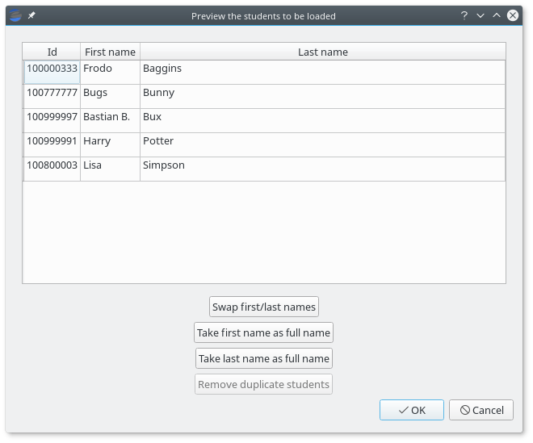

From this dialog,
you'll be able to swap the first and last name columns,
just in case the were provided in the wrong order
or treat one of these columns as the full name,
in case Eyegrade wrongly detected separate columns.

Eyegrade won't allow you to load several students with the same student id.
If that happens,
the affected students will be highlighted
and you'll be able to remove them from here.

You can accept or cancel the preview dialog.
If you accept it,
the students will appear now in your student list:

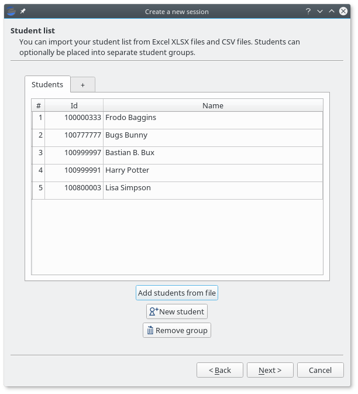

You can also create a new group by clicking on the right-most tab header,
rename a group by doubly-clicking on a tab header
and remove the active group by pressing the *Remove group* button.
Groups in which at least one student has an already graded exam
cannot be removed:

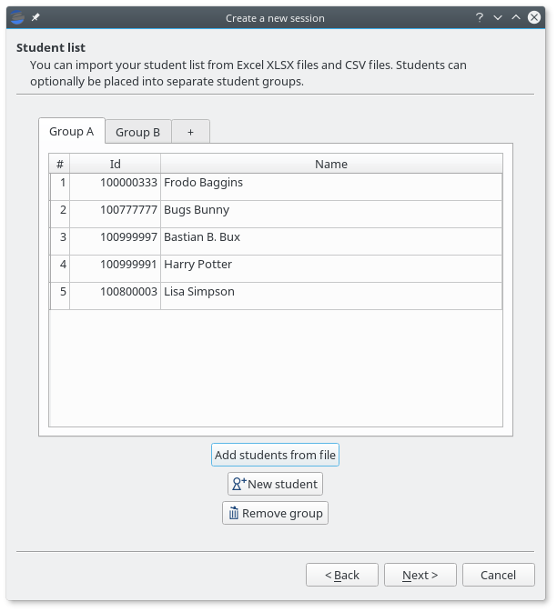

The session directory
.....................

A grading session in Eyegrade represents the grading of a specific
exam for a group of students. For example, you would grade the exams
for the final exam of all your students in the subject *Computer
Networks* in just one session. Other exams, such as the re-sit exam of
the same subject, should go in separate sessions.

Grading sessions are associated to a directory in your computer. You
select or create this directory when you create a new session.
Eyegrade stores there all the data belonging to the grading session
(configuration file, student lists, grades, images of the already
graded exams, etc.)

You can open again later an existing session with the *Open session*
option of the *Session* menu. In the file selection dialog that
appears, select the ``session.eyedb`` file inside the directory of the
session you want to open. When you open the session, you can continue
grading new exams that belong to that session.

Scores
.......

Eyegrade can compute the scores of the exams.
When you create a new session, you can select
in the last page of the wizard one
of the following three options:

- No scores: Eyegrade shows the number of correct and incorrect questions,
  but does not compute scores.

- Same score for all the questions: all the questions
  are awarded the same score.
  You must specify the score for each correct question.
  Optionally, if you want incorrect or blank questions
  to have a penalty in the score,
  you can also specify a (negative) score for incorrect
  questions and for blank questions.

- Base score plus per-question weight:
  in this mode, not all the questions have the same score.
  You must define a *base score*
  (a reference score for correct, incorrect and blank questions)
  and, for each question, a relative *weight*.
  The final score for a question is computed as the multiplication
  of its weight and the base score.
  This mode can also be used for voiding questions:
  when you assign a weight of 0 to a question,
  it does not contribute to the score of the exam.

Same score for all the questions
~~~~~~~~~~~~~~~~~~~~~~~~~~~~~~~~~

When you select this option,
all the questions count the same in the score of the exam.
Eyegrade counts the number of correct, incorrect and blank answers,
and multiplies each one by the score assigned
to each of those types of answers.

For example, suppose an exam with 10 questions,
in which correct answers add 1 point to the score
and incorrect answers subtract 1/3 points (one third of a point).
A student having 7 correct and 3 incorrect answers
will get 6 points (7 * 1 - 3 * 1/3).

You specify those scores in the last step of the session creation wizard:

.. image:: images/same-score-dialog.png
   :alt: Dialog for specifying the same score for all the questions

Giving a positive score for correct answers is mandatory in this mode.
The score for incorrect and blank answers is optional,
and defaults to 0 when you don't enter it.

Eyegrade can automatically compute the appropriate scores for you
if you specify the total score that a perfect exam would achieve.
In order to do that, press the *Compute default scores* button,
and the following dialog appears:

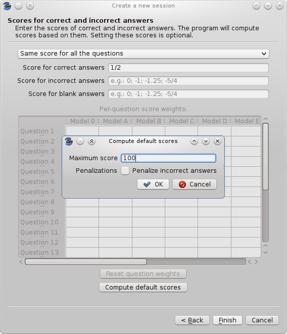

The dialog computes the score for correct answers
as the total score for a perfect exam divided by the number of questions.
If you select the *Penalize incorrect answers* option,
a score for incorrect answers is also computed
as the score for correct answers divided by
the number of choices of each question minus one.
This way, the expected score for an exam with random answers
(all the questions have the same probability of being marked by the student)
is zero.

Base score plus per-question weight
~~~~~~~~~~~~~~~~~~~~~~~~~~~~~~~~~~~~~

When you select this option for computing scores,
not all the questions are awarded the same score.
Important questions may get bigger scores than less important ones.
In order to do that, you define a base score
(e.g. 2 points for correct answers and -2/3 for incorrect ones)
and a relative *weight* for each question.
The *weight* of a question is a factor that multiplies the base score
in order to get the actual score of that question.
For example, for a question that you want to score double than the base score
(4 points for correct answers and -4/3 for incorrect ones)
you would set a weight of 2.
For a question you want to have exactly the base score,
you would set a weight of 1.
You can even decrease the score of a question with respect to he base score.
A weight of 1/2 would mean
1 point for correct answers and -1/3 for incorrect ones
in our example.

You need to edit the scores in the table at the center of the dialog:

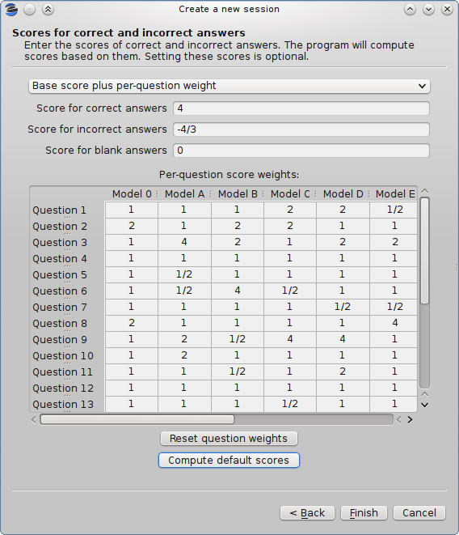

You can enter in each cell integer numbers (e.g. "2"),
fractions (e.g. "1/2")
or decimal numbers with fractional digits (e.g. "2.5").
If you have several exam models
(alternative orderings of the questions),
eyegrade will check that you enter the same weights
in all the models, possibly in a different order for each model:

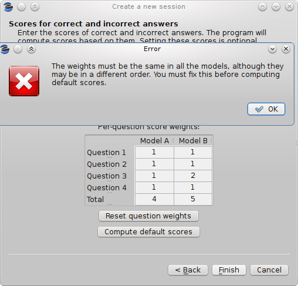

In addition, if your session configuration file
contains the permutations done to each model
(if you create the documents of your exams with Eyegrade,
it will),
Eyegrade automatically updates the value in all the models
every time you change the weight of a question in one of them.
However, if the file does not contain the permutations,
you'll need to enter the weights for all the models yourself.

The *Compute default scores* button works also as expected
in this mode.
It takes into account the question weights you entered
in order to compute the base scores.
You should edit the question weights
*before* computing the default base scores.

Assigning weight 0 to a question voids it:

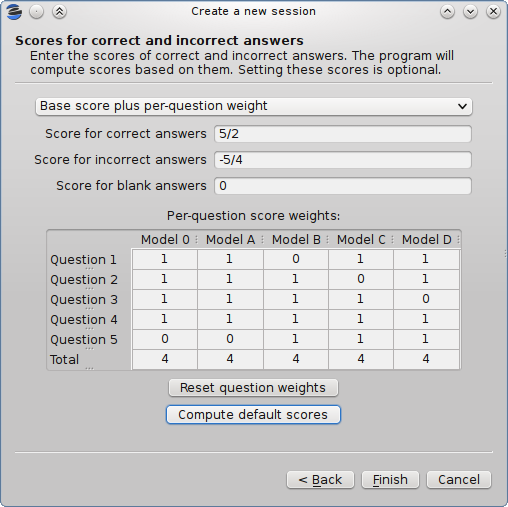

The example above voids question 5 in model A,
which is also question 1 in model B, question 2 in model C
and question 3 in model D.
Void questions will be clearly displayed
in the capture of the exam,
and won't be considered either for the score
or the count of correct and incorrect questions:

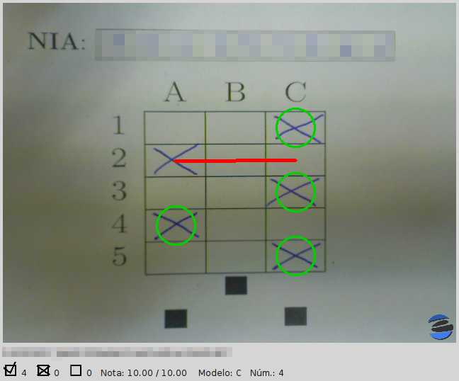

Application modes
.................

At a given instant, the application is in one of these modes:

- *No session mode*: no session is open. You can open an existing
  session or create a new session.

- *Session home mode*: a session is open. This is the entry point for
  starting grading and reviewing already graded exams.

- *Grading mode*: the application continually scans the input from the
  webcam, looking for a correct detection of an exam.

- *Review mode*: the application shows a still capture of an exam with
  the result of the grading, so that the user can review it and fix
  answers or the student id, if necessary.

- *Manual detection mode*: in the rare cases in which the system is
  not able to detect the geometry of the exam in the *grading mode*,
  you can enter this mode and mark the corners of the answer
  tables. Eyegrade will be able to detect the tables once you tell it
  where the corners are.

The application starts with no open session. Once you open or create a
session, it changes to the *session home mode*. From it, you can start
or continue grading (enter the *grading mode* with the *Start grading*
command) or review already graded exams (enter the *review mode* by
clicking on an exam at the right side of the main window).

When you are in the *grading mode*, the program is continually
analyzing the image of the webcam. When it detects an answer sheet
that it can read, it locks the capture and enters the *review
mode*. Once you confirm that capture (command *Continue to the next
exam*), Eyegrade automatically goes back to the *search mode* in order
to scan the next exam.

You can enter the *manual detection mode* by issuing the appropriate
command while in the other modes.

From the *grading mode* you can go back to the session home mode with
the *Stop grading* command. From any of the other modes, you can go
back to the *no session mode* with the *Close session* command in the
*Session* menu.

The grading mode
................

In the *grading mode*, you have to get the camera to point to the answer table
of the exam, including, if present, the id box above it and the small squares
at the bottom.

Eyegrade will continually scan the input of the webcam until the whole
exam is correctly detected. At that moment, Eyegrade will switch to the
*review mode*.

Sometimes, Eyegrade is able to detect the answer table but not the ID
table at the top of it. You can notice that because the detected
answers are temporary shown on top of the image. At this point, you
may try further until the ID box is also detected, or just use the
*Capture the current image* command of the *Grading* menu, which will
force the system to switch to the *review mode*, using the most recent
capture in which the answer table was detected. You will be able to
manually enter the missing student id in that mode.

In rare occasions, Eyegrade could fail event to detect the answer
table.  The *Manual detection* command of the *Grading menu* allows
you to help the system detect it.

These are the commands available in the *grading mode*, all of them at
the *Grading* menu:

- *Capture the current image* (shortcut 's'): forces the system to
  enter the *review mode* with the the most recent capture in which
  Eyegrade was able to detect the answer table. If there is no such
  capture, the system just uses the current capture.

- *Manual detection of answer tables* (shortcut 'm'): the system
  enters the *manual detection mode*, in which you can help the system
  detect the answer table by marking the corners of the answer
  tables. After that, the system will detect the answers of the
  student and automatically enter the *review mode*. See `The manual
  detection mode`_.

The review mode
...............

In the *review mode* you can review and, if necessary, fix the
information detected by Eyegrade in the current exam. You can do it on
both the answers given by the student to each question and the
student id. You enter the *review mode* in one of the following three
different situations:

- With the answers of the student and her id detected. This is the
  usual case.  Eyegrade was able to detect the whole exam, and you can
  review the information extracted from it.

- With the answers of the student, but without her id. This is the
  case when you use the *Capture the current image* command in the
  *grading mode* because Eyegrade detected the answer table in at least
  one capture, but not the student id box. In this case, you can
  review the answers given by the student and manually enter her id.

- With neither the answers of the student nor her id. This is the case
  when you use the *Capture the current image* command in the *grading
  mode* because Eyegrade was not able to detect anything from the
  exam. In this situation, you can switch to the *manual detection
  mode* to help the system to detect the answer tables, and manually
  enter the student id.

The user interface shows, in this mode, a capture of the exam augmented
with the detected information, as shown in the following image:

.. image:: images/review-mode-normal.png
   :alt: Eyegrade in the review mode

As you can see, the system shows:

- The answers of the student, with a green circle for correct answers
  and a red circle for the incorrect ones. When the student leaves a
  question unanswered, or provides a wrong answer for it, the correct
  answer for that question is marked with a small dot.

- The detected student id, at the bottom of the image, and his name
  (when the name is provided in the student list files).

- The total number of correct, incorrect and blank answers, at the
  bottom.  The total score of the exam is also shown if the session is
  configured with the scores for the answers.

- The model of the exam. The model is detected from the small black
  squares that are printed below the answer table.

- The sequence number of this exam. It is incremented with each graded
  exam.

In this mode, you can perform the following actions (see the *Grading*
menu):

- Modify the answers of the student, if there are mistakes in the
  automatically-detected answers, as explained in `Modifying student
  answers`_.

- Modify the student id, if the system did not recognize it or
  recognized a wrong id, as explained in `Modifying the
  student id`_.

- *Continue to the next exam* (shortcut 'Space-bar'): enters the
  *grading mode* in order to detect the next exam. **Tip:** before
  saving, it is better to remove the exam from the sight of the camera
  to avoid it from being captured again. You can even put the next
  exam under the camera before saving to speed up the process.

- *Discard capture* (shortcut 'Delete'): discards
  the current capture **without** saving it. It is useful, for
  example, when the capture is not good enough, or when you discover
  that the same exam has already been graded before.

- *Manual detection of answer tables* (shortcut 'm'): the system
  enters the *manual detection mode*, in which you can help the system
  detect the answer table by marking the corners of the answer
  tables. After that, the system will detect the answers of the
  student and automatically enter again the *review mode*. This
  command is allowed only when the system failed to recognize the
  geometry of the answer tables. See `The manual detection mode`_.

Modifying student answers
~~~~~~~~~~~~~~~~~~~~~~~~~

The optical recognition system of Eyegrade may fail sometimes, due to
its own limitations, or students filling their exams in messy ways.
Sometimes, Eyegrade shows a cell in the answer table as marked when it
is not, or a cell is not marked when it actually is. In addition, if
Eyegrade thinks that two cells of the same question are marked, it
will leave that question as blank.

You are able to fix those mistakes at the *review mode*. Click on a
cell of the answer table to change an answer of the student that was
not correctly detected by Eyegrade: when the student marked a given
cell, but the system detected the question as blank, or simply showed
other answer of that question as marked, just click on the cell the
student actually marked. When the student left a question blank but
the system did mark one of the cells as the answer, click on that cell
to clear it. In both cases, Eyegrade will compute the scores again and
immediately update the information on the screen.

Modifying the student id
~~~~~~~~~~~~~~~~~~~~~~~~

Normally, you should provide Eyegrade with the list of class, because
detection of student ids performs much better in that case. When
scanning the id in an exam, Eyegrade sorts ids of the students in
class according to the estimated probability of being the id in the
exam. The one with the most probability is shown.

In the *review mode*, you can enter the correct student id when
Eyegrade does not detect it, or detects a wrong one. When you select
the *Edit student id* command in the *Grading* menu, a dialog for
selecting the student id is shown:

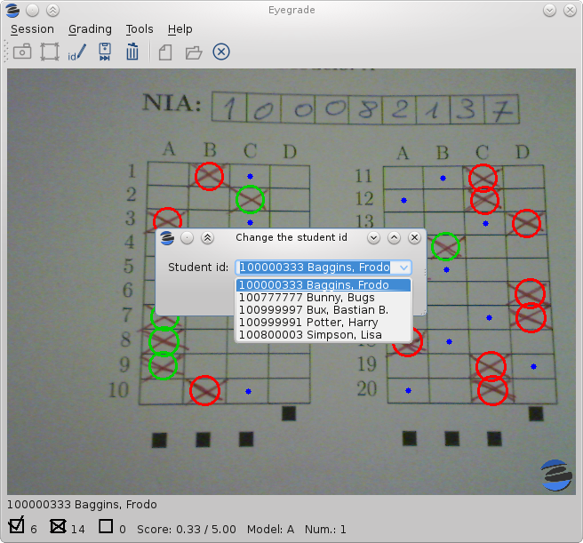

The dialog shows a drop-down menu with the students from the student
list sorted by their
probability (according to the OCR module) of being the student whose
id is in the exam. You just choose any student in the list.
In addition, you can filter students by writing part of their id number
or their name.

If the student is not in your list, you can also push the
*New student* button to create a new student.
It opens a dialog in which you can enter the data.
The only mandatory field is this dialog is the student id number:

.. image:: images/new-student-dialog.png
   :alt: Dialog for creating a new student

The manual detection mode
.........................

In some rare occasions, Eyegrade may not be able to detect the answer
tables. In those cases, you can enter the *manual detection mode* from
the *grading mode* (and also from the *review mode* if you entered that
mode using the *Capture the current image* command). When entering the
*manual detection mode*, the latest capture of the camera will be
shown.

In this mode, just click with the cursor in the four corners of each
answer table (a small circle will appear in every location you
click). The order in which you click on the corners does not
matter. After having done that, Eyegrade will infer the limits of each
cell, and based on them it will read the answers of the student and
the exam model. It will enter then the *review mode*.

The following two images show an example. In the first image, the user
has selected six corners (notice the small blue circles):

.. image:: images/manual-detection-mode.png
   :alt: Eyegrade in the review mode

After she selects the remaining two corners, the system detects the
answers and goes back to the *review mode*:

.. image:: images/manual-detection-mode-2.png
   :alt: Eyegrade in the review mode

Note, however, that the student id will not be detected when you use
this mode. When the system goes back to the *review mode*, set the id
as explained in `Modifying the student id`_.

At any point of the process, you can use the *Manual detection of
answer tables* command (shortcut 'm') to reset the selection of
corners and start again. If you think that the captured image is not
good enough, you can also use the *discard* command (shortcut
'Backspace') to go again to the *grading mode*.

**Tip:** in the *manual detection mode*, make sure that the captured
image shows all the answer tables as well as the exam model squares at
the bottom.

Processing Student Grades
-------------------------

The easiest  way to get the scores of your students
once you've graded the exam is `Exporting a listing of scores`_.
You'll get a spreadsheet that you can open with Microsoft Excel,
Libreoffice and other compatible spreadsheet software.

In addition, Eyegrade will produce some files
within the session directory,
including a snapshot of each graded exam.
See `Output within the session directory`_ for more information.

Exporting a listing of scores
.............................

You will probably want to export your listing of scores in order to
import it into the grade-book, spreadsheet, etc. you use.
This can be done from the user interface (menu *Exams /
Export grades listing*).

First, the program shows a dialog like the following one:

.. image:: images/export-dialog.png
   :alt: Export dialog.

In this dialog you have to select:

- The format of the output file.
  You can choose between Office Open XML format
  (.XLSX files that can be opened from Microsoft Excel, LibreOffice
  and other compatible spreadsheet software)
  or a plain text file with tabulator-separated fields.

- The students to include in the listing: all the students in the
  student list or just the students whose exam has been graded in this
  session.

- The student groups to include in the listing: the grades for just a
  specific group of students or the grades for all the groups. This
  option is hidden if there is just one student group in the current
  session (see `Student lists`_ for more information about groups).
  If you want to all the groups into a .XLSX spreadsheet,
  you can also choose to place each group within a separate *workbook*
  of this spreadsheet.

- How the grades are sorted: according to the order in the student
  list you imported or according to the order in which you graded the
  exams.

- Which fields to include in the listing: student id number, student
  full name, student last name, student first name,
  grading sequence number, exam model letter, number of correct
  and incorrect answers, score and full list of answers. Only the
  fields you check are exported (as columns of the exported file). The
  order of these fields in the exported file is the same you see in
  the dialog (first the student id number, then her name, etc.).
  You can change column order later with your spreadsheet software if needed.

Once you complete the selection of options and press the *OK* button,
a new dialog allows you to select the location and name with which the
file will be saved.  The proper filename extension
(`.xslx` or `.csv`) is automatically set
if you type a name without extension.

Output within the session directory
......................................

The output produced by Eyegrade within the session directory
consists mainly of the following files:

- A file with the scores, named ``eyegrade-answers.csv``: it contains
  one line for each graded exam. Each line contains, among other
  things, the student id number, the number of correct and incorrect
  answers, and the answer to every question in the exam.  Student
  grades can be extracted from this file.  The file with the scores is
  stored in the session directory. Eyegrade updates its contents when
  you close the session. Remember to close it before using this file.

- One snapshot of each graded exam, in PNG format: snapshots can be
  used as an evidence to show students. They can be shown to students
  coming to your office to review the exam, or even emailed to every
  student. The default name for those images is the concatenation of
  the student id and exam sequence number, in order to facilitate the
  instructor to locate the snapshot for a specific student. The
  captures are stored in the session directory, inside its
  ``captures`` subdirectory. The captures are saved when the exam is
  captured, and updated every time you edit the exam.

The file ``eyegrade-answers.csv`` produced by Eyegrade contains the
scores in CSV format (with tabulator instead of comma as a separator),
so that it can be easily imported from other programs such as
spreadsheets. This is an example of such a file::

    0	100999991	D	9	6	4.5	1/2/2/4/1/2/2/0/0/3/2/0/3/2/0/4/3/0/1/2
    1	100999997	C	15	1	15.0	2/4/4/3/1/0/1/2/1/1/0/1/0/4/3/0/1/4/3/4
    2	100800003	D	6	14	6.0	4/2/2/2/1/2/1/3/2/1/3/1/2/1/3/1/4/1/4/3
    3	100777777	A	7	13	7.0	3/2/3/2/3/3/2/4/3/1/3/1/4/1/4/2/2/3/4/2

The columns of this file represent:

1.- The exam sequence number (the same number the user interface shows
below the student id in the *review mode*).

2.- The student id (or '-1' if the student id is unknown).

3.- The exam model ('A', 'B', 'C', etc.)

4.- The number of correct answers.

5.- The number of incorrect answers.

6.- The score of the exam, if you configured the weight of correct and
incorrect answers for this session.

7.- The response of the student to each question in the exam, from the
first question in her model to the last. '0' means a blank
answer. '1', '2', etc. mean the first choice, second choice, etc., in
the order they were presented in her exam model.

Exams are in the same sequence they were graded. See `Exporting a
listing of scores`_ to know how to produce a listing of scores
with the columns and student order
that best fits your needs.

Editing exams
-------------

Although you can use any software of your preference to typeset the
exams, Eyegrade provides a module for doing that
in combination with the LaTeX document preparation system.

The procedure consists of four steps,
which are described in the next sections:

#. Edit an XML file with the questions themselves.

#. Edit a LaTeX template for your exam
   with your institution's look and feel,
   instructions to students, etc.
   This template is reusable for other exams in the future.

#. Automatically generate the PDF files
   from the XML file and the LaTeX template.

The example files used in the following explanations
are provided with Eyegrade
inside its `doc/sample-files` directory
(also `accessible at GitHub
<https://github.com/jfisteus/eyegrade/tree/development/doc/sample-files>`_).

This guide assumes that you have a LaTeX system installed.
If you don't have it in your system,
follow the instructions in `Installing the LaTeX system`_.

Editing the questions of the exam
..................................

You need to typeset your questions in an XML document.
You may use your favorite text editor for that.

At the beginning of the file
you should provide some basic data about the exam,
such as:
the name of the course/subject,
the name of the degree,
the name of the exam,
the date
and the duration of the exam.
You don't need to provide all those values,
just the ones you want printed in the exam.

In addition,
you can optionally configure there
the scores to be awarded/detracted for correct/incorrect answers
and configuration for student id detection.
Got to `Configuring student id detection`_
and `Configuring scores`_ for more details
about these two options.

Then, write the questions one by one.
For each question, you have to provide:

- The statement of the question.

- An optional picture to be displayed with the question.

- An optional block of code (for programming exams and the like)
  to be formatted with a fixed-width font
  and preserving spacing.

- The text of the correct choice.

- The text of the incorrect choices.

The XML markup must be like shown in the following example:

.. include:: ../sample-files/exam-questions.xml
   :literal:

You can insert LaTeX markup
within the text of the statement and the choices
if you need, for example,
to insert a math equation
or format a piece of text in italics, boldface
or typewriter font::

    <question>
      <text>
        Text in \emph{italics}, \textbf{boldface}
        and \texttt{typewriter} font style.
      </text>
      <choices>
        <correct>A LaTeX equation: $x^2 - 1$</correct>
        <incorrect>Nothing</incorrect>
      </choices>
    </question>

Inserting pictures
~~~~~~~~~~~~~~~~~~~

For inserting a picture in the statement of the question,
you use the `<figure>` tag.
Its file name must be provided within
the `<figure>` and `</figure>` tags.
It takes the following configuration attributes:

- `eye:width`: width of the picture relative to
  paragraph width
  (1.0 means the full width, 0.5 means half width, etc.)
  The picture will be scaled up or down accordingly.
  This attribute is mandatory.

- `eye:position`: position of the picture.
  Use `center` for placing it just below the statement of the question
  and above the choices.
  Use `right` for laying out the question in two columns:
  the statement of the question and the choices at the left
  and the picture at the right.
  The default value is `center`.

This is an example::

  <question>
    <text>
      Is the thing in the right a logo?
    </text>
    <figure eye:width="0.16" eye:position="right">sample-logo.eps</figure>
    <choices>
      <correct>Well, it tries to be a logo, to be honest.</correct>
      <incorrect>No, it's a tree.</incorrect>
      <incorrect>No, it's a perfect square.</incorrect>
      <incorrect>Who knows!</incorrect>
    </choices>
  </question>

A vertical separation line between the text of the question
and the picture
will be inserted
with the `eye:separation="line"` attribute::

  <figure eye:width="0.16" eye:position="right" eye:separation="line">sample-logo.eps</figure>

Pictures can also be used inside a choice.
It that case, the choice can only contain the picture
and the `eye:position` attribute must not be used::

  <correct>
    <figure eye:width="0.2">sample-logo.eps</figure>
  </correct>

Inserting blocks of code
~~~~~~~~~~~~~~~~~~~~~~~~~

For inserting a block of code in the statement of the question,
you use the `<code>` tag.
The code itself is given within the `<code>` and `</code>` tags.
White space and end-of-line characters
are displayed as you provide them.
It takes the following configuration attributes:

- `eye:position`: position of the block of code.
  Use `center` for placing it just below the statement of the question
  and above the choices.
  Use `right` for laying out the question in two columns:
  the statement of the question and the choices at the left
  and the piece of code at the right.
  The default value is `center`.

- `eye:width`: only if you select the two column layout
  (position `right`),
  provide the width of the right column relative to
  paragraph width
  (0.5 means half width, etc.)
  Remember to leave enough place for the left side.
  This attribute is mandatory for the `right` position
  and forbidden for the `center` position.

This is an example::

    <code eye:position="right" eye:width="0.4">for letter in ['a', 'b', 'c']:
        print letter</code>

A vertical separation line between the text of the question
and the block of code
will be inserted
with the `eye:separation="line"` attribute::

    <code eye:position="right" eye:width="0.4" eye:separation="line">for letter in ['a', 'b', 'c']:
        print letter</code>

Blocks of code can also be used inside a choice.
It that case, the choice can only contain the block of code
and neither attribute can be used::

    <incorrect>
    <code>class MyClass:
        pass
    </code>
    </incorrect>

Configuring student id detection
~~~~~~~~~~~~~~~~~~~~~~~~~~~~~~~~~

If you want Eyegrade to detect student ids,
you can provide a `studentId` element as shown in the example
at `Editing the questions of the exam`_.
You just need to specify the length (number of digits) of student ids
and the label that will be printed on the exam at the left
of the box where students will write down their ids::

    <studentId eye:label="ID" eye:length="8" />

If you provide a valid student id length,
a student id box will automatically be inserted above the answer tables.
Don't include the *studentId* element in your questions file
if you don't want Eyegrade to detect student ids.
The student id box won't appear in the exam in that case.

Configuring scores
~~~~~~~~~~~~~~~~~~~~~~~~~~~~~~~~~

You can optionally provide within the questions file
the score to be awarded for correct answers
and the score to be detracted for wrong answers
by using the `scores` element,
as shown in the example
at `Editing the questions of the exam`_.
If you provide your scores here,
they will automatically be saved into the exam configuration file.
If you prefer not to,
you'll still be able to enter scores later,
when you create the grading session
(see section `Scores`_).

You have two ways to provide scores within the questions file.
The first way consists in directly specifying those scores.
For example, in order to awarding one point to correct answers::

  <scores eye:correct="1" />

Scores can also be provided as fractional or decimal numbers::

  <scores eye:correct="3/2" />
  <scores eye:correct="1.5" />

By default, wrong answers don't detract points,
but you can change this behavior.
The following example penalizes wrong answers with half the score
of a correct answer::

  <scores eye:correct="1" eye:incorrect="1/2" />

For example, a student that got 8 correct answers and 2 incorrect answers
would get 7 points (8 - 2 * 1/2).

You can alternatively let Eyegrade compute scores
by specifying the maximum grade
a student can get::

  <scores eye:maxScore="100" />

In the example above, if there were 10 questions in your exam,
Eyegrade would automatically assign 10 points
to correct answers.

Wrong answers don't get a penalization in the example above.
If you want a penalization so that the expected value for random answers
is a score of 0,
you can specify::

  <scores eye:maxScore="100" eye:penalize="true" />

In the example above,
in an exam with 10 questions with 3 choices each,
wrong answers would get a penalization of 5 points.
A student that answers randomly would be an average of 10/3 correct answers
and 20/3 incorrect answers, for a final score of 10 * 10 / 3 - 5 * 20 / 3 = 0.

You can inject these scores into your LaTeX template
(see `Injecting scores into your LaTeX template`_).
In addition,
if you want those scores to be followed
by the *point* or *points* words
depending on whether the score is 1 or a different value
(e.g. *1 point* or *1/2 points*),
you can include in your exam questions file
the `pointsWords` element with the word
for the singular *point* and the plural *points*
in the language of your exam,
as in the following example::

  <scores eye:maxScore="10" eye:penalize="true" />
  <pointsWords eye:singular="point" eye:plural="points" />

Editing the LaTeX template
...........................

In addition to the questions of the exam,
you'll need a LaTeX template.
It allows you to design the front page of the exam
and other aspects (fonts, margins, etc.)

The LaTeX template
~~~~~~~~~~~~~~~~~~~~~~~~~~~~~~~~~~~~~~~~

This is an example:

.. include:: ../sample-files/template.tex
   :literal:

In the template, notice that there are some marks within {{ and }}
that are intended to be replaced by the script with data from the
exam:

- `{{declarations}}`: the script will put there some LaTeX declarations
  it needs.
- `{{subject}}`, `{{degree}}`: name of the subject and degree it
  belongs to. Taken from the XML file with the questions.
- `{{title}}`: the title of the exam. Taken from the XML file with the
  questions.
- `{{duration}}`: duration of the exam. Taken from the XML file with
  the questions.
- `{{model}}`: a letter representing the model of the exam. Each model
  has a different ordering for questions and choices within questions.
- `{{score_correct}}` and `{{score_incorrect}}`:
  score for correct answers
  and penalization for incorrect answers.
  The latter is printed as a positive number.
- `{{answer-table}}`: replaced by the table in which students mark out
  their answers.
- `{{questions}}`: replaced by the questions of the exam.
- `{{variation}}`: the exam variation selected for this exam.
  Its value is "0" if no variation has been selected,
  or "1", "2", etc. if a variation has been selected.

Note that a template is highly reusable for different exams and
subjects because of the use of these marks
to inject these pieces of data
that usually change from exam to exam.

Injecting scores into your LaTeX template
~~~~~~~~~~~~~~~~~~~~~~~~~~~~~~~~~~~~~~~~~~~

As explained above,
the `{{score_correct}}` and `{{score_incorrect}}` marks
are replaced by the scores of correct and incorrect answers
(see also `Configuring scores`_).

If you want your template to say something
like *1 point* and *2 points*
(note the use of the singular and plural forms of the word *point*),
just insert these words in the XML file that contains the questions
with the `pointsWords` element as explained at
`Configuring scores`_.
The *point* or *points* words
(or those words that you configured in the XML file for your language)
will be appended automatically to the score
in that case.

Creating the PDF files
................................

Once the exam file and the template have been created,
the `eyegrade-create` program parses them and generates the exam in PDF format,
provided that LaTeX is installed and available in your system's `PATH`
(see `Installing the LaTeX system`_).

You'll use the `eyegrade-create.exe` (just `eyegrade-create` on Linux)
binary file.
The only way to run `eyegrade-create` by now is from a command-prompt console.
If you are on Windows,
you'll need to provide its full location in the console::

  "C:\Program File (x86)\eyegrade\app\eyegrade-create" --version

Don't forget to add the double quotation marks
because of the white spaces within its path.
Alternatively,
you may add the `C:\\Program Files (x86)\\eyegrade\\app`
to your system's `PATH`
(see, for example,
`this guide about changing the PATH variable in Windows 10 <https://www.architectryan.com/2018/03/17/add-to-the-path-on-windows-10/>`_).
If you do that, you won't need to enter the full path of the program::

  eyegrade-create --version

On Linux, just run `eyegrade-create` from a console,
because with the two suggested installation methods the program
will be in your shell's `PATH` variable::

  eyegrade-create --version

Once you are able to run `eyegrade-create`,
let's see how to create the PDF files of your exams.
Run the following command
from a command-line console
(remember to change it to the full path if you are in Windows
and it isn't in your `PATH`)::

  eyegrade-create -e exam-questions.xml -m 0AB template.tex -o exam

It will create models 0, A and B of the exam with
names `exam-0.pdf`, `exam-A.pdf` and `exam-B.pdf`. The exam model 0 is a
special exam in which questions are not reordered.
The correct answer is always the first choice in the model 0.
The model 0 is convenient while editing the questions,
but you must remember not to use it in the exam itself.

In addition, Eyegrade will automatically create the ``exam.eye`` file
needed to grade the exams, or update it if it already exists.

If Eyegrade encounters an error in the process,
you'll see the reason of the error in one of the following two ways:

- If the error is in the XML syntax of the file with the questions,
  you'll get the error message and line of the XML file
  in which it was encountered.

- If the error is in your LaTeX template
  or in the LaTeX markup of your questions,
  you'll get the output of the LaTeX command,
  which will tell the line in which it happened
  relative to the temporary LaTeX file Eyegrade has created
  (e.g. `exam-0.tex`).
  Eyegrade will leave this file,
  as well as the full transcript of the error (e.g. `exam-0.log`)
  in the same directory
  in which the output would be produced in order to help you locate
  the reason of the error.

The script `create_exam.py` has other features, like creating just the
front page of the exam (no questions needed). They can be explored with
the command-line help of the program::

  eyegrade-create -h

The answer table can be enlarged or reduced with respect to its
default size, using the `-S` option and passing a scale factor
(between 0.1 and 1.0 to reduce it, or greater than 1.0 to enlarge it).
The following command enlarges the default size in a 50% (factor 1.5)::

  eyegrade-create -e exam-questions.xml -m A template.tex -o exam -S 1.5

Installing the LaTeX system
.............................

LaTeX is included in the repositories of the major Linux distributions.
In Debian and Ubuntu you can simply
install the package `texlive-latex-recommended`::

  sudo apt-get install texlive-latex-recommended

For MS Windows there are some LaTeX distributions
that provide a graphical installer,
such as `ProText <https://www.tug.org/protext/>`_:

#. Download the ProText installer
   (be aware that the size of the download is over 3 GB).

#. From the installer, choose to install MiKTex.
   When you are offered a minimal or full installation,
   the minimal one is enough.

#. You probably won't need to install TeXstudio,
   which is also offered by the installer.

Advanced exam editing
..........................

Fixing the position of a choice
~~~~~~~~~~~~~~~~~~~~~~~~~~~~~~~~~~

Choices can be prevented from being randomly ordered
with the `eye:fix` attribute,
which can take the values "first" (to fix a choice as the first one)
and "last" (to fix a choice as the last one).
For example::

  <question>
    <text>
      What is Python?
    </text>
    <choices>
      <correct>A programming language</correct>
      <incorrect>A computer manufacturer</incorrect>
      <incorrect>A kind of tree</incorrect>
      <incorrect eye:fix="last">None of the options above is correct.</incorrect>
    </choices>
  </question>

If more than one choice are fixed first or last,
the choices fixed *first* will appear at the beginning,
in the same order they are declared in the XML file,
and the choices fixed *last* will appear at the end,
also in the same order they are declared in the XML file.

Question groups
~~~~~~~~~~~~~~~~~~~~~~~~~~~~~~~~~~~~~~~

Starting from Eyegrade 0.9, you can group interdependent questions.
Grouped questions will be shown always in the same order you defined them.
That is, they won't be shuffled within their group,
but the group itself will be shuffled with respect to other single questions
and groups in the exam.

In addition, groups allow you to define, optionally,
a piece of text and a figure or a piece of code,
which will be shown before the first question of the group.
They are intended to show common information that applies to all
the questions of the group.

A question group is defined in your XML document
by using the `<group>` tag where you would normally
place just single questions.
The questions that compose that group are defined
in the usual way with `<question>` tags
inside the `<group>` tag.
The following example shows how to define a group::

  <?xml version="1.0" encoding="UTF-8"?>

  <exam xmlns="http://www.it.uc3m.es/jaf/eyegrade/ns/"
        xmlns:eye="http://www.it.uc3m.es/jaf/eyegrade/ns/">

    <subject>Set theory</subject>
    (...)
    <group>
      <common>
        <text>
          Given the set $A = \{a, b, c, d\}$:
        </text>
      </common>
      <question>
        <text>
          What's the cardinality of $A$?
        </text>
        <choices>
          <correct>4</correct>
          <incorrect>3</incorrect>
          <incorrect>$\infty$</incorrect>
        </choices>
      </question>

      <question>
        <text>
          What's the intersection of $A$ with $\{d, f, a\}$?
        </text>
        <choices>
          <correct>$\{a, d\}$</correct>
          <incorrect>$\{a, b, c, d, f\}$</incorrect>
          <incorrect>$\{b, c\}$</incorrect>
        </choices>
      </question>

      <question>
        <text>
          And the union of $A$ with $\{d, f, a\}$?
        </text>
        <choices>
          <correct>$\{a, b, c, d, f\}$</correct>
          <incorrect>$\{a, d\}$</incorrect>
          <incorrect>$\{a, b, c, d, d, f, a\}$</incorrect>
        </choices>
      </question>
    </group>

    <question>
      <text>
        The powerset of a set $A$ is:
      </text>
      <choices>
        <correct>
          The set whose elements are all the possible subsets of $A$.
        </correct>
        <incorrect>
          The cartesian product $A \times A$.
        </incorrect>
        <incorrect>
          The set $A \cup A$.
        </incorrect>
      </choices>
    </question>

    (...)
  </exam>

In the example above, the first three questions will always
appear in exactly that order.
The fourth question, and other questions or groups you define,
would be shuffled and appear before or after these three questions.
A visual hint that these questions form a group will also be shown,
so that students know where groups begin and end.
Additionally,
as you can see in the example above,
you can set an optional common section
for a question group,
in which you can insert text, code or a picture
the same way you would do in the statement of a normal question.
They will be displayed in the exam before the first question
of the exam.

Questions with variations
~~~~~~~~~~~~~~~~~~~~~~~~~~~~~

Sometimes you may want slightly different variations of the same question
to appear in different models of the exam.
For example, a question that asks the student to solve a linear equation
could be defined with two variations,
each one with a slightly different equation to solve.

There are two ways of defining question variations.
The first one consists in
writing the different variations as full questions,
like shown below::

  <question>
    <variation>
      <text>
        Given the set $A = \{a, b, c, d\}$,
        what's its cardinality?
      </text>
      <choices>
        <correct>4</correct>
        <incorrect>3</incorrect>
        <incorrect>$\infty$</incorrect>
      </choices>
    </variation>
    <variation>
      <text>
        Given the set $A = \{x, y, z\}$,
        what's its cardinality?
      </text>
      <choices>
        <correct>3</correct>
        <incorrect>4</incorrect>
        <incorrect>$\infty$</incorrect>
      </choices>
    </variation>
  </question>

The second one consists in writing a question template
based on some parameters,
and defining different values for those parameters in each variation::

  <question>
    <variation_params>
      <variation>
        <param eye:name="setA">\{a, b, c, d\}</param>
        <param eye:name="correct">$\{a, d\}$</param>
        <param eye:name="incorrect1">$\{a, b, c, d, f\}$</param>
        <param eye:name="incorrect2">$\{f\}$</param>
      </variation>
      <variation>
        <param eye:name="setA">\{b, d, e, f\}</param>
        <param eye:name="correct">$\{d, f\}$</param>
        <param eye:name="incorrect1">$\{a, b, d, e, f\}$</param>
        <param eye:name="incorrect2">$\{a\}$</param>
      </variation>
    </variation_params>
    <text>
      What's the intersection of {{setA}} with $\{d, f, a\}$?
    </text>
    <choices>
      <correct>{{correct}}</correct>
      <incorrect>{{incorrect1}}</incorrect>
      <incorrect>{{incorrect2}}</incorrect>
    </choices>
  </question>

When a model of the exam is shuffled,
a variation will be randomly and independently chosen
for every question containing variations.
This is the default behavior of the `eyegrade-create` command.

Note that questions contained within groups are an exception:
as explained below,
the same variation will be chosen for all the questions in the same group.
However, different variations might be chosen
for questions in different groups of the same exam model.

Alternatively to letting the system choose variations randomly,
you can force a given variation number to be chosen
for all the questions and groups in a given model.
For example,
the commands below choose the first variation of every question
for models A and B,
and the second variation for models C and D::

  eyegrade-create -e exam-questions.xml -m AB template.tex -o exam --variation=1
  eyegrade-create -e exam-questions.xml -m CD template.tex -o exam --variation=2

If you use the `--variation` argument to choose a variation number,
all the questions with variations
are expected to contain at least that number of variations.
For example, if you set `--variation=3` to choose the third variation,
all the questions must either no variations
or at least three variations.

Question groups with variations
~~~~~~~~~~~~~~~~~~~~~~~~~~~~~~~~~~

If your questions belong to a group, you either define separate questions,
each one defining its own variations,
or define parameters at the group level,
and use them through the questions of that group::

  <group>
    <variation_params>
      <variation>
        <param eye:name="equation">$2x + 3 = 7$</param>
        <param eye:name="x">2</param>
        <param eye:name="xIncorrect1">-2</param>
        <param eye:name="xIncorrect2">0</param>
        <param eye:name="equiv1">$2x - 4 = 0$</param>
        <param eye:name="equiv2">$x + 3 = 3$</param>
        <param eye:name="equiv3">$2x + 10 = 0$</param>
      </variation>
      <variation>
        <param eye:name="equation">$3x + 2 = 11$</param>
        <param eye:name="x">3</param>
        <param eye:name="xIncorrect1">-3</param>
        <param eye:name="xIncorrect2">0</param>
        <param eye:name="equiv1">$3x - 9 = 0$</param>
        <param eye:name="equiv2">$x + 2 = 2$</param>
        <param eye:name="equiv3">$3x + 13 = 0$</param>
      </variation>
    </variation_params>
    <common>
      <text>
        Consider the equation {{equation}}:
      </text>
    </common>
    <question>
      <text>
        What's the solution to the equation?
      </text>
      <choices>
        <correct>$x={{x}}$</correct>
        <incorrect>$x={{xIncorrect1}}$</incorrect>
        <incorrect>$x={{xIncorrect2}}$</incorrect>
      </choices>
    </question>
    <question>
      <text>
        The equation is equivalent to:
      </text>
      <choices>
        <correct>{{equiv1}}</correct>
        <incorrect>{{equiv2}}</incorrect>
        <incorrect>{{equiv3}}</incorrect>
      </choices>
    </question>
  </group>

Note that, for a given exam model,
the same variation will be chosen for all the questions in the group.
Because of that,
all the questions belonging to the same group must contain either
no variations or the same number of variations.
For example, the group defined above contains questions with two variations.
If you add more questions to the group,
they must contain two variations or no variation at all.

Advanced features
-----------------

Preserving the order of some questions when shuffling
.......................................................

*(New in Eyegrade 0.9)*

When you use `eyegrade-create` to typeset an exam,
all the questions of the exam get shuffled by default.
However, you might want sometimes to keep the order
of some questions that are related and form a logical sequence.
In order to do that, just wrap those related questions
with a `group` element in the XML file that defines the questions,
such as in the following example:

.. include:: ../sample-files/exam-questions-groups.xml
   :literal:

Every time the questions in the previous example get shuffled,
the first three questions (Q1, Q2 and Q3) will be treated as a group,
and their internal order will be preserved.
That is, Q1, Q2 and Q3 will appear always together and in this order.
The same will happen with the last two questions (Q6, Q7).
Some possible orderings will be:

- Q4, Q1, Q2, Q3, Q5, Q6, Q7

- Q6, Q7, Q1, Q2, Q3, Q5, Q4

- Q5, Q4, Q6, Q7, Q1, Q2, Q3

Creating the exams in a word processor
........................................

The current prototype of Eyegrade require users to know LaTex in order
to personalize exam templates. This section explains an alternative
way to create exams compatible with Eyegrade in a word processor such
as Microsoft Word. If you create your own exams with a word processor,
you'll need also to enter the exam configuration
when you create a new grading session.
See `Manual configuration of the exam`_
if you want to enter the values through the user interface of Eyegrade
or `Manually editing the .eye file`_
if you prefer to use a text editor.

The objective is emulating the tables that Eyegrade creates so that
the program can read them. This is an example:

.. image:: images/example-table.png
   :alt: Example answer tables.

You can use as a template this `example MS Word document
<samples/sample-exam.doc>`_. It shows an answer table for 20 questions,
which you can edit in order to customize if for your
needs. Nevertheless, you should read the rest of this section if you
are planning to customize the answer table.

An *answer table* is a table in which rows represent the questions and
columns represent the choices. There can be more than one answer
table, but they have to be side by side (they cannot be placed one
above the other). The example above show two answer tables. A few
restrictions have to be taken into account:

- If there are more than one table, they must be horizontally
  aligned. That is, their top and bottom must be in the same line, and
  their rows must have exactly the same height (see the example above).

- All the rows should have the same height.

- In order to improve the detection process, the length of the
  vertical lines and the length of the horizontal lines should be more
  or less proportionate (e.g. one of them should not be more than a
  30% larger than the other). If there are more than one answer table,
  consider the added length of the horizontal lines of every
  table. The following image illustrates this. The red vertical line
  is not much smaller than the sum of the two horizontal lines.

.. image:: images/example-table-lengths.png
   :alt: Example answer tables.

- If an answer table has less rows than the others, it is better to
  keep the horizontal lines, as shown in the image below:

.. image:: images/example-table-2.png
   :alt: Example answer tables.

The boxes for the student ID number should be above the answer tables,
not too close but not too far away either (see the example below).
The width of the student ID table should be comparable to the sum of
the width of the answer tables (approximately no less than 2/3 of that
sum, and no more than 3/2). Student IDs with just a few digits (two,
three, four) can potentially be problematic for wide answer tables.

.. image:: images/example-table-id.png
   :alt: Example answer tables with student ID box.

At the bottom of the answer boxes there must be some black
squares. They encode the exam model (permutation). In addition, they
help the system to know whether the detection of the answer tables was
correct.

Imagine that there are two more rows at the end of each answer table,
with the same height as the other rows.  Squares will be either in the
one above or in the one below, and there must be a square per
column. Squares should be centered in those imaginary cells. The
position (above/below) of a square conveys the information read by
Eyegrade as binary information.

The exam model is encoded with three squares. Therefore, there can be
eight different models. The fourth square is a redundancy code for the
previous three squares. This 4-square pattern is repeated from left to
right as long as there are columns. The table to which a column
belongs is not taken into account. For example, if there are two
answer tables with three columns each, the fourth square (the
redundancy square) is placed at the first column of the second
table. The other two columns of the second answer table would contain
the same squares as the first two columns of the first table.

The following table show the 4-square pattern for each exam model, as
they should be placed from left to right:

+-------+---------------------------+
| Model |                           |
+-------+------+------+------+------+
|   A   | Down | Down | Down |  Up  |
+-------+------+------+------+------+
|   B   |  Up  | Down | Down | Down |
+-------+------+------+------+------+
|   C   | Down |  Up  | Down | Down |
+-------+------+------+------+------+
|   D   |  Up  |  Up  | Down |  Up  |
+-------+------+------+------+------+
|   E   | Down | Down |  Up  | Down |
+-------+------+------+------+------+
|   F   |  Up  | Down |  Up  |  Up  |
+-------+------+------+------+------+
|   G   | Down |  Up  |  Up  |  Up  |
+-------+------+------+------+------+
|   H   |  Up  |  Up  |  Up  | Down |
+-------+------+------+------+------+

Manually editing the .eye file
........................................

The files that store the configuration of an exam and the correct
answer for each question are stored with a `.eye` extension. An example
is shown below:

    .. include:: ../sample-files/exam.eye
       :literal:

The file is just plain text and can be edited with any text editor. It
has several sections: *exam*, *solutions* and *permutations*.

The fields of the *exam* section are:

- `dimensions`: here the number of answer tables and the number of
  columns and rows in each answer table are configured. For example,
  "4,6;4,6" means that there are two answer tables, both of them with
  geometry "4,6".  The "4" is the number of columns of the table. The
  "6" is the number of rows. Tables are specified from left to right
  (i.e. the first table geometry corresponds to the left-most table in
  the exam).

- `id-num-digits`: number of cells of the table for the student id
  number.  Putting a 0 here means that the id number needs not to be
  read.

- `correct-weight`: a number, such as 1.75, that represents the score
  assigned to a correct answer.

- `incorrect-weight`: a number that represents the score to be
  substracted for failed answers. Blank answers are not affected by
  this.

The fields `correct-weight` and `incorrect-weight` are optional. If
they appear in the file, the program will show the total score in the
user interface.

The *solutions* section specifies the correct answers for each model
(permutation) of the exam. Models are identified by letters ("A", "B",
etc.). For example::

    model-A: 4/1/2/1/1/1/2/4/1/2/3/1
    model-B: 3/2/1/4/4/2/2/1/4/2/3/3

In the example above, in the model A, the correct answer for the first
question is the 4th choice, for the second question is the 1st choice,
for the third question is the 2nd choice, etc.

The *permutations* section has information that allows to know how
questions and choices have been shuffled with respect to the original
order. They are used only for extracting statistics or fixing grades
after the exam if the solutions used for grading are found to have an
error in some questions. If you create the `.eye` manually, you
probably want to just remove this section from the file, unless you
need some of the above-mentioned functions.

Automatic detection of exam removal
...................................

If the camera in your setup is fixed, that is, you place an exam below
the camera, review it, remove it and place the next exam, you may want
Eyegrade to detect that you have removed the exam instead of having to
click on the *Save and capture next exam command*.

You can activate this experimental feature in the *Tools* menu,
*Experimental* submenu, option *Continue on exam removal*. When this
option is checked, Eyegrade saves the current capture and enters the
*search mode* automatically, after a few seconds of not detecting an
exam. Before placing the new exam, wait for the system to actually
enter the *search mode*: if you are too quick, Eyegrade might not
detect the removal of the exam.

**Tip:** don't use this option if the camera is not fixed, because
just moving it a little bit may cause Eyegrade to think that the exam
has been removed.
