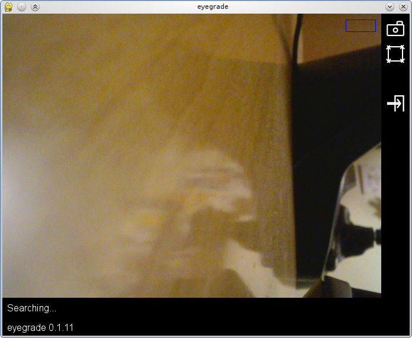
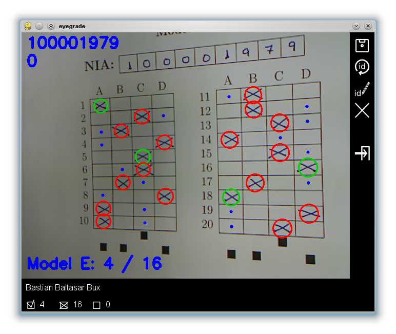
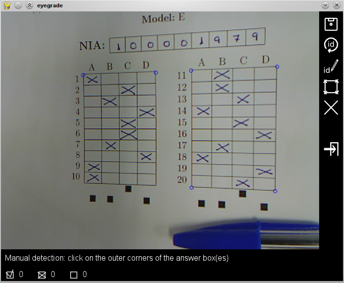
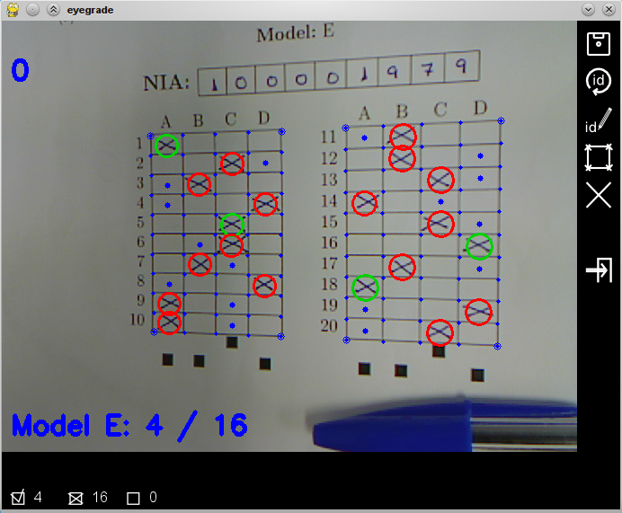
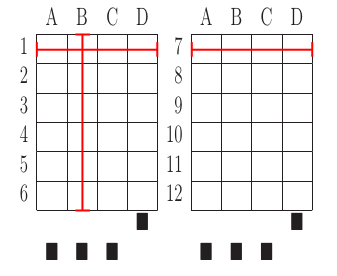

Eyegrade User Manual
====================

:Author: Jesús Arias Fisteus

.. contents::

Installing Eyegrade
-------------------

Eyegrade depends on the following free-software projects:

- Python_: the run-time environment and standard library for the
  execution Python programs. Eyegrade is known to work with Python
  2.6.

- Opencv_: a widely used computer-vision library. Version 2.0 or later
  is needed. Not only the OpenCV library, but also the python bindings
  distributed with it are needed.

- Pygame_: a Python library for building games.

- Tre_: a library for regular expressions. Install version 0.8.0 or
  later.  Both the library and python bindings are needed.

.. _Python: http://www.python.org/
.. _Opencv: http://opencv.willowgarage.com/wiki/
.. _Pygame: http://pygame.org/
.. _Tre: http://laurikari.net/tre/

Installation on GNU/Linux
.........................

If your Linux distribution is not very old, it should provide most of
the needed software packages. Specific instructions for Debian
GNU/Linux and Ubuntu are provided below.

Installation on Debian and Ubuntu
~~~~~~~~~~~~~~~~~~~~~~~~~~~~~~~~~

Almost all the required software packages are already available in
recent versions of `Debian GNU/Linux <http://www.debian.org/>`_ and
`Ubuntu <http://www.ubuntu.com/>`_. The only exception are the Python
bindings for Tre, which have to be installed manually.

Using your favorite package manager (``apt-get``, ``aptitude``,
``synaptic``, etc.), install the following packages: ``python`` (check
that the version is either 2.6 or 2.7), ``python-pygame``,
``python-opencv``, ``libavformat53``, ``libtre5``. In older versions
of Ubuntu and Debian, you might need to install also ``libcv2.1`` (in
even older versions, the name of this package is ``libcv4`` instead).
If you can't find ``libavformat53`` in your distribution, use
``libavformat52`` instead.

Then, you have to install the Python bindings for Tre. First, install
these two additional packages: ``python-dev``, ``libtre-dev``.
Then, from the command line, download, compile and install the Python
bindings::

  wget http://laurikari.net/tre/tre-0.8.0.tar.gz
  tar xzvf tre-0.8.0.tar.gz
  cd tre-0.8.0/python/
  python setup.py build
  sudo python setup.py install

Now, you only need to download Eyegrade using the git source code
revision system (install the ``git`` package if you do not have it)::

  cd $DIR
  git clone -b master git://github.com/jfisteus/eyegrade.git

Note: replace $DIR above with the directory in which you
want Eyegrade to be installed.

Finally, add the ``$DIR/eyegrade/src`` directory to your ``PYTHONPATH`` and
check that Eyegrade works::

  export PYTHONPATH=$DIR/eyegrade/src
  python -m eyegrade.eyegrade -h

The export command works only in the current terminal. You can make it
permanent by adding it to your $HOME/.bashrc file (if you use the BASH
shell).

That's all! Eyegrade should now be installed. For further testing, go to
`Launching Eyegrade`_.

Installation on Microsoft Windows
.................................

You have to follow these three steps, explained in the following
sections, in order to install Eyegrade in Windows:

1.- Install Python 2.6 (including Pygame and Tre).

2.- Install OpenCV 2.1.

3.- Install Eyegrade itself.

Installing Python
~~~~~~~~~~~~~~~~~

The easiest way to install Python, Pygame and Tre in Windows is
to download a ZIP file that contains all of them and extract it in
your file system.

1.- Download the ZIP file from:
<http://www.it.uc3m.es/jaf/eyegrade/downloads/Python26.zip>.

2.- Extract it somewhere in your file system (I recommend ``C:\``). A
directory named ``Python26`` will appear. Be aware that the full path
of the directory where you extract it *cannot contain* white-spaces.

3.- Add the main directory (``Python26``) of your Python installation
to your system PATH. For example, if you uncompressed Python at ``C:\``,
add ``C:\Python26`` to the system PATH variable.

You can test your installation by opening a new command line console
and launching the interactive Python interpreter in it::

    Python

If it does not start, you have probably not added it correctly to your
system PATH. Opening a new console is important because changes in the
system PATH apply only to newly-opened consoles.

Once in the Python interpreter, the following commands should work::

    import pygame
    import tre

These commands should not output any message. If they do, there is a
problem with the installation. If *tre* complains about a missing DLL,
the problem is probably that the installation directory of Python is
not in the system PATH.

If you already have a Python 2.6 installation and want to use it, you
must, on that installation of Python: (1) download and install Pygame;
(2) download and install Tre 0.8.0. You will need Microsoft Visual
Studio 2008 (the express version is free and works) for this last
step.

Installing OpenCV
~~~~~~~~~~~~~~~~~

Download the EXE installer of OpenCV 2.1.0 for Windows platforms:
`OpenCV-2.1.0-win32-vs2008.exe
<http://sourceforge.net/projects/opencvlibrary/files/opencv-win/2.1/OpenCV-2.1.0-win32-vs2008.exe/download>`_. There
is a copy of the same file at `OpenCV21.exe
<http://www.it.uc3m.es/jaf/eyegrade/downloads/OpenCV21.exe>`_.

Execute the installer. Again, it is better to choose an installation
path which has no white-spaces in it. The installer will eventually
ask to put OpenCV in your system PATH. Answer *yes for this user* or
*yes for all the users*.

In order to test the installation, open a *new* command prompt window
(it must necessarily be a new window for the system path to be
updated). Run the python interpreter as explained in the previous
section and type in it::

    import cv

This command should not output any message. If it does, there is a
problem with the installation.

Installing Eyegrade
~~~~~~~~~~~~~~~~~~~

By now, the recommended way to install Eyegrade is through the `Git
version control system <http://git-scm.com/>`_. This way it will be
easier to update Eyegrade in the future, when new versions are
released (see `Updating Eyegrade`_).

In order to install Eyegrade through Git, follow these steps:

1.- Download and install Git if you do not have it installed. The
installer and installation instructions are available at
<http://git-scm.com/>.

2.- Open a command line prompt (for example, a Git shell), enter the
directory you want Eyegrade to be installed (again, with no
white-spaces in it), and type::

    git clone -b master git://github.com/jfisteus/eyegrade.git

If you prefer not to install Git:

1.- Go to `the page of Eyegrade at Github
<https://github.com/jfisteus/eyegrade>`_, click on the *Downloads*
button and select the most recent release. Extract it in your file
system, in a directory with no white-spaces in its path.

Once you have Eyegrade installed (either with or without Git), test
it. For example, if you have installed both Python and Eyegrade at
``C:\``::

    set PYTHONPATH=C:\eyegrade\src
    C:\Python26\python -m eyegrade.eyegrade -h

It should dump a help message. Eyegrade should now be installed. For
further testing, go to `Launching Eyegrade`_.

**Tip:** it may be convenient adding C:\Python26 to your system path
permanently, and adding PYTHONPATH to the system-wide environment
variables. There are plenty of resources in the Web that explain how
to do this. For example,
<http://www.windows7hacker.com/index.php/2010/05/how-to-addedit-environment-variables-in-windows-7/>.

Installation on Mac OS X
........................

Sorry, Eyegrade is not currently supported on that platform. Volunteers
to support the platform are welcome.

Updating Eyegrade
.................

From time to time, a new release of Eyegrade may appear. If you
installed Eyegrade using Git, updating is simple. Open a command
prompt window, enter the Eyegrade installation directory and type::

    git pull

This should work on any platform (Linux, Windows, etc.)

Grading Exams
-------------

.. |icon_snapshot| image:: images/snapshot.png
.. |icon_manual_detect| image:: images/manual_detect.png
.. |icon_exit| image:: images/exit.png
.. |icon_save| image:: images/save.png
.. |icon_discard| image:: images/discard.png
.. |icon_next_id| image:: images/next_id.png
.. |icon_edit_id| image:: images/edit_id.png

The main purpose of Eyegrade is grading exams. In order to grade exams,
you will need:

- The Eyegrade software installed in your computer.
- The exam configuration file, which specifies the number
  of questions in the exam, solutions, etc. It is normally named
  *exam.eye*.
- A compatible webcam, with minimum resolution 640x480.
- The list of students in your class, if you want Eyegrade to
  detect student IDs.
- The exams to grade.

Launching Eyegrade
..................

Eyegrade can be launched from command line::

    python -m eyegrade.eyegrade exam.eye

where ``exam.eye`` is the file that holds the configuration of the
exam (number of questions, geometry of tables, correct answers, etc.)

Inside the directory ``doc/sample-files`` you can find a sample exam,
named ``exam-A.pdf``, that you can print for testing the program. The
corresponding ``exam.eye`` file is also there.

If you want Eyegrade to read student's identity, it is recommended to
provide it with the list of students in class::

    python -m eyegrade.eyegrade exam.eye -l student-list.csv

where ``student-list.csv`` is a tabulator-separated file in which
there are one line per student. The first column must be the student
identifier.  The second column (optional) must be the student
name. Other columns, if present, are ignored.

Eyegrade will start up and show its graphical interface, as shown in
the next picture:

The interface is quite simple:

- The output of the webcam is shown in the main area of the window.

- A toolbar is shown at the right. We will go through the meaning of these
  buttons later.

- Two status lines are shown at the bottom. They show different pieces
  of information depending on the currently active mode.

Application modes
.................

At a given instant, the application is in one of these two modes:

- *Search mode*: the application continually scans the input from the webcam,
  looking foir a correct detection of an exam.

- *Review mode*: the application shows a still capture of an exam with the
  result of the grading, so that the user can review the result and
  fix things if necessary before saving the score of the exam.

- *Manual detection mode*: in the rare cases in which the system is
  not able to detect the geometry of the exam, you can enter this mode
  and mark the corners of the answer tables. Eyegrade will be able to
  detect the tables once you tell it where the corners are.

Obviously, the application starts in the *search mode*. When the
system detects an answer sheet that can be read, it locks the capture
and enters the *review mode*. Once you save the score of the exam,
Eyegrade automatically goes back to the *search mode* in order to scan
the next exam.

You can enter the *manual detection mode* by issuing the appropriate
command while in the other modes.

The search mode
...............

In the *search mode*, you have to get the camera to point to the answer table
of the exam, including, if present, the id box above it and the small squares
at the bottom.

Eyegrade will continually scan the input of the webcam until the whole
exam is correctly detected. At that moment, Eyegrade will switch to the
*review mode*.

Sometimes, Eyegrade is able to detect the answer table but not the ID
table at the top of it. You can notice that because the detected
answers are temporary shown on top of the image. At this point, you
may try further until the ID box is also detected, or just use the
*snapshot* command (see the table below), which will force the system
to switch to the *review mode* using the most recent capture in which
the answer table was detected. You will be able to manually enter the
missing student id in that mode.

In rare occasions, Eyegrade could fail event to detect the answer table.
The *manual detection* command allows you to help the system detect it.

These are the commands available in the *search mode*:

- |icon_snapshot| *snapshot* (shortcut 's'): forces the system to
  enter the *review mode* with the the most recent capture in which
  Eyegrade was able to detect the answer table. If there is no such
  capture, the system just uses the current capture.

- |icon_manual_detect| *manual detection* (shortcut 'm'): the system
  enters the *manual detection mode*, in which you can help the system
  detect the answer table by marking the corners of the answer
  tables. After that, the system will detect the answers of the
  student and automatically enter the *review mode*. See `The manual
  detection mode`_.

- |icon_exit| *exit* (shortcut 'Escape'): Eyegrade terminates. There is
  no risk of losing data, because the scores of previous exams are
  already saved in a file.

The review mode
...............

In the *review mode* you can review and, if necessary, fix the information
detected by Eyegrade in the current exam. You can review and fix both the
answers given by the student to each question and the student id. You can
enter the *review mode* in three different situations:

- With the answers of the student and her id detected. This is the
  usual case.  Eyegrade was able to detect the whole exam, and you can
  review the information extracted from it.

- With the answers of the student, but without her id. This is the case
  when you use the *snapshot* command in the *search mode* because Eyegrade
  detected the answer table in at least one capture, but not the student
  id box. In this case, you can review the answers given by the student
  and manually enter her id.

- With neither the answers of the student nor her id. This is the case
  when you use the *snapshot* command in the *search mode* because Eyegrade
  was not able to detect anything from the exam. In this situation,
  you can switch to the *manual detection mode* to help the system
  detect the answer tables, and manually enter the student id.

The user interface shows, in this mode, a capture of the exam augmented
with the detected information, as shown in the following image:

As you can see, the system shows:

- The detected student id, at the upper-left corner, and his name at the
  bottom, as taken from the student list you provided.

- The sequence number of the exam, just below the student id. This
  sequence number is automatically incremented by Eyegrade for each
  exam it scans.

- The answers of the student, with a green circle for correct answers
  and a red circle for incorrect ones. When the student leaves a
  question unanswered or provides a wrong answer for it, the correct
  answer for that question is marked with a small blue dot.

- The total number of correct, incorrect and blank answers, at the bottom.
  This information is also shown on top of the image, at its left-bottom
  corner.

- The model of the exam, on top of the image, at the left-bottom. The
  model is detected from the small black squares that are printed
  below the answer table.

In this mode, you can perform the following actions:

- Modify the answers of the student, if there are mistakes in the
  automatically-detected answers, as explained in `Modifying student
  answers`_.

- Modify the student id, if the system did not recognize it or
  recognized a wrong id, as explained in `Modifying the
  student id`_.

- |icon_save| *save* (shortcut 'Space-bar'): saves the grades of this
  exam as well as the annotated captured image, and enters the *search
  mode* in order to detect the next exam. **Tip:** before saving, it
  is better to remove the exam from the sight of the camera to avoid
  it from being captured again. You can even put the next exam under
  the camera before saving to speed up the process.

- |icon_discard| *discard* (shortcut 'Backspace'): discards the
  current capture **without** saving. It is useful, for example, when
  the capture is not good enough, or when you detect the same exam has
  already been graded before.

- |icon_manual_detect| *manual detection* (shortcut 'm'): the system
  enters the *manual detection mode*, in which you can help the system
  detect the answer table by marking the corners of the answer
  tables. After that, the system will detect the answers of the
  student and automatically enter again the *review mode*. This
  command is allowed only when the system failed to recognize the
  geometry of the answer tables. See `The manual detection mode`_.

- |icon_exit| *exit* (shortcut 'Escape'): exits Eyegrade **without**
  saving the current exam. However, there is no risk to loose data
  from any exam that was saved before.

Modifying student answers
~~~~~~~~~~~~~~~~~~~~~~~~~

The optical recognition system of Eyegrade my fail sometimes, due to
its own limitations, or students filling their exams in messy ways.
Sometimes, Eyegrade shows a cell in the answer table as marked when it
is not, or a cell is not marked when it actually is. In addition, if
Eyegrade thinks that two cells of the same question are marked, it
will leave that question as blank.

You are able to fix those mistakes at the *review mode*. Click on a
cell of the answer table to change an answer of the student that was
not correctly detected by Eyegrade: when the student marked a given
cell, but the system detected the question as blank, or simply showed
other answer of that question as marked, just click on the cell the
student actually marked. When the student left a question blank but
the system did mark one of the cells as the answer, click on that cell
to clear it. In both cases, Eyegrade will compute the scores again and
immediately update the information on the screen.

Modifying the student id
~~~~~~~~~~~~~~~~~~~~~~~~

Normally, you should provide Eyegrade with the list of class, because
detection of student ids performs much better in that case. When
scanning the id in an exam, Eyegrade sorts ids of the students in
class according to the estimated probability of being the id in the
exam. The one with the most probability is shown.

In the *review mode*, there are several ways to set the student id
when Eyegrade does not detect it, or detects a wrong one.

- |icon_next_id| *next id* (shortcut 'Tabulator' or 'Down arrow'):
  selects the next id in the sorted list of ids. When the detected id
  is wrong, is usual that the correct id is in the next two or three
  positions of the list, so it may be worth using this command at
  least a couple of times.

- *previous id* (shortcut 'Up arrow'): selects the previous id in the
  sorted list of ids. It allows you to go back if you missed the
  correct id while using the *next id* command.

- Type some digits from the correct id: other way of entering the
  correct id is by typing some consecutive digits of the id. The most
  probable id from the list of class containing that sequence of
  digits is selected.  Each time you type a digit, the id is
  updated. Just type a few digits until you get the id you
  want. **Tip:** sometimes the first digits of ids are the same for
  many students in class. Begin typing at a position in which ids are
  more variable. **Tip:** if you typed some digits but want to cancel
  your selection or begin again with new digits, use the *next id*
  or *previous id* commands.

- |icon_edit_id| *edit id* (shortcut 'i'): use this command to
  manually enter the whole id, digit by digit, from left to
  right. Just save the exam after entering the last digit. The entered
  id is not checked against the list of class: you are allowed to
  enter just any number. This mode is useful only when a student is
  not in the list of class, or the list of class is not available.

Note that the first two ways to select the student id are available
only when Eyegrade has the list of class.

**Tip:** when you need to correct an id, first use the *next id*
option a few times. If after that the correct one does not appear,
type a sequence of digits of the correct id, until Eyegrade selects
the correct id.

**Tip:** with the *edit id* command, there is no way to tell Eyegrade
that you have finished entering it: just save the exam and go to the
next exam.

**Tip:** if you select *edit id* and make some mistakes when entering
the id, you can begin to type again from the beginning by selecting
again the *edit id* command.

The manual detection mode
.........................

In some rare occasions, Eyegrade may not be able to detect the answer
tables. In those cases, you can enter the *manual detection mode* from
the *search mode* (and also from the *review mode* if you entered that
mode using the *snapshot* command). When entering the *manual
detection mode*, the latest capture of the camera will be shown.

In this mode, just click with the cursor in the for corners of each
answer table (a small circle will appear in every location you
click). The order in which you click on the corners does not
matter. After having done that, Eyegrade will infer the limits of each
cell, and based on them it will read the answers of the student and
the exam model. It will enter the *review mode*.

The following two images show an example. In the first image, the user
has selected six corners (notice the small blue circles):

After she selects the remaining two corners, the system detects the
answers and goes back to the *review mode*:

Note, however, that the student id will not be detected when you use
this mode. When the system goes back to the *review mode*, set the id
as explained in `Modifying the student id`_.

At any point of the process, you can use the *manual detection*
command (shortcut 'm') to reset the selection of corners and start
again. If you think that the captured image is not good enough, you
can also use the *discard* command (shortcut 'Backspace') to go again
to the *search mode*.

**Tip:** in the *manual detection mode*, make sure that the captured
image shows all the answer tables as well as the exam model squares at
the bottom.

Processing Student Grades
-------------------------

The output produced by Eyegrade consists of:

- A file with the scores, named ``eyegrade-answers.csv``: it contains
  one line for each graded exam. Each line contains, among other
  things, the student id number, the number of correct and incorrect
  answers, and the answer to every question in the exam.  Student
  grades can be extracted from this file.

- One snapshot of each graded exam, in PNG format: snapshots can be
  used as an evidence to show students. They can be shown to students
  coming to your office to review the exam, or even emailed to every
  student. The default name for those images is the concatenation of
  the student id and exam sequence number, in order to facilitate the
  instructor to locate the snapshot for a specific student.

The answers file
................

The file ``eyegrade-answers.csv`` produced by Eyegrade contains the
scores in CSV format (with tabulator instead of comma as a separator),
so that it can be easily imported from other programs such as
spreadsheets. This is an example of such a file::

    0	100999991	D	9	6	0	1/2/2/4/1/2/2/0/0/3/2/0/3/2/0/4/3/0/1/2
    1	100999997	C	15	1	0	2/4/4/3/1/0/1/2/1/1/0/1/0/4/3/0/1/4/3/4
    2	100800003	D	6	14	0	4/2/2/2/1/2/1/3/2/1/3/1/2/1/3/1/4/1/4/3
    3	100777777	A	7	13	0	3/2/3/2/3/3/2/4/3/1/3/1/4/1/4/2/2/3/4/2

The columns of this file represent:

1.- The exam sequence number (the same number the user interface shows
below the student id in the *review mode*).

2.- The student id (or '-1' if the student id is unknown).

3.- The exam model ('A', 'B', 'C', etc.)

4.- The number of correct answers.

5.- The number of incorrect answers.

6.- The number of undetermined answers (answers marked as blank because
of the system detecting more than one marked cell).

7.- The response of the student to each question in the exam, from the
first question in her model to the last. '0' means a blank
answer. '1', '2', etc. mean the first choice, second choice, etc., in
the order they were presented in her exam model.

Exams are in the same sequence they were graded. See `Exporting a
listing of scores`_ to know how to produce a listing of scores in the
order that best fits your needs.

**Tip:** if you start a new grading session from the same directory,
the file ``eyegrade-answers.csv`` will not be overwritten. New grades
will just be appended at the end. Thus, it is safe stopping a grading
session, closing the application and continuing later. Separate grading
sessions must be executed from different directories to avoid using
the same ``eyegrade-answers.csv`` file.

**Tip:** you can edit this file with a text editor if, for example,
you discover that the same exam was graded more than once (just remove
the duplicate line).

Exporting a listing of scores
.............................

You will probably want to import the listing of scores from your
grade-book. You can easily process ``eyegrade-answers.csv`` to produce
a CSV-formatted file with three columns: student id, number of correct
answers and number of incorrect answers, in the order you want. You
can even produce the listing to for just a subset of the students.

In order to do that, you need a listing of students whose grades you
want to list. The listing must be a CSV file in which the first column
contains the student ids (the rest of the columns will be just
ignored). Normally, you will use the same listing of students you used
to run Eyegrade. This is an example of such a file::

    100000333	 Baggins, Frodo
    100777777	 Bunny, Bugs
    100999997	 Bux, Bastian B.
    100999991	 Potter, Harry
    100800003	 Simpson, Lisa

This command will produce the listing in a file named
``sorted-listing.csv``::

    python -m eyegrade.mix_grades eyegrade-answers.csv student-list.csv -o sorted-listing.csv

The output for the listing above, and the sample file shown in `The
answers file`_, would be::

    100000333		
    100777777	 7	13
    100999997	 15	1
    100999991	 9	6
    100800003	 7	13

Scores will be in the same order as the student list. The second and third
columns represent the number of correct and wrong answers, respectively.
In the example, the first student has those columns empty because there
is no exam associated to his id.

Importing the previous file in a spreadsheet should be
straightforward, because the list of students will now be in the same
order as your spreadsheet.

If there are exams in the answers file of students not in your list,
the default behavior is including them in the listing, after the rest
of the students. The rationale behind this behavior is apreventing
accidental losses of student scores. This behavior can be changed (see
`Exporting a listing for a subset of students`_).

See `Mixing manually-graded questions`_ if you need to produce
listings in exams combining MCQ questions with manually-graded
questions.

Exporting a listing for a subset of students
~~~~~~~~~~~~~~~~~~~~~~~~~~~~~~~~~~~~~~~~~~~~~

In order to extract the scores for just a subset of the students,
create a student list with the ids of the students you want and run
the program with the ``-i`` option::

    python -m eyegrade.mix_grades eyegrade-answers.csv student-list.csv -i -o sorted-listing.csv

The ``-i`` option makes Eyegrade ignore students that are in the
answers file but not in the student list. That is, the listing will
only contain the students that are in the student list you provide.

This option may be useful, for example, if you examine students coming
from different classes or groups. With this option you can produce a
separate listing for each class.

Editing exams
-------------

Although you can use any software of your preference to typeset the
exams, Eyegrade provides a module for doing that in combination to the
LaTeX document preparation system.

First, write your questions in an XML document like the following one:

    .. include:: ../sample-files/exam-questions.xml
       :literal:

Then, create a LaTeX template for the exam. This is an example:

    .. include:: ../sample-files/template.tex
       :literal:

In the template, notice that there are some marks within {{ and }}
that are intended to be replaced by the script with data from the
exam:

- `{{declarations}}`: the script will put there declarations needed
  for the generate LaTeX file.
- `{{subject}}`, `{{degree}}`: name of the subject and degree it
  belongs to. Taken from the XML file with the questions.
- `{{title}}`: the title of the exam. Taken from the XML file with the
  questions.
- `{{duration}}`: duration of the exam. Taken from the XML file with
  the questions.
- `{{model}}`: a letter representing the model of the exam. Each model
  has a different ordering for questions and choices within questions.
- `{{id-box(9,ID}}`: replaced by a box for students to fill in their IDs.
  The number of digits and the text to be put at the left of the box are
  specified within the parenthesis.
- `{{answer-table}}`: replaced by the table in which students mark out
  their answers.
- `{{questions}}`: replaced by the questions of the exam.

Note that a template is highly reusable for different exams and
subjects.

Once the exam file and the template have been created, the script
`create_exam.py` parses them and generates the exam in LaTeX format::

  python -m eyegrade.create_exam -e exam-questions.xml -m 0AB template.tex -o exam

The previous command will create models 0, A and B of the exam with
names `exam-0.tex`, `exam-A.tex` and `exam-B.tex`. Exam model 0 is a
special exam in which questions are not reordered. The correct answer
is always the first choice. Those files can be compiled with LaTeX to
obtain a PDF that can be printed. In addition, the ``exam.eye`` file
needed to grade the exam is automatically created (or updated if it
already exists).

The script `create_exam.py` has other features, like creating just the
front page of the exam (no questions needed). They can be explored with
the command-line help of the program::

  python -m eyegrade.create_exam -h

The answer table can be enlarged or reduced with respect to its
default size, using the `-S` option and passing a scale factor
(between 0.1 and 1.0 to reduce it, or greater than 1.0 to enlarge it).
The following command enlarges the default size in a 50% (factor 1.5)::

  python -m eyegrade.create_exam -e exam-questions.xml -m A template.tex -o exam -S 1.5

Advanced features
-----------------

Webcam selection
................

If your computer has more than one camera (e.g. the internal camera of
the laptop and an external camera you use to grade the exams),
Eyegrade will select one of them by default. If the selected camera is
not the camera you want to use to grade the exams, use the ``-c
<camera-number>`` option when invoking Eyegrade. Cameras are numbered
0, 1, 2, 3, etc. Invoke Eyegrade with a different camera number until
the interface displays the one you want. For example, to select the
camera numbered as 2::

    python -m eyegrade.eyegrade exam.eye -c 2 -l student-list.csv

When the number is -1, eyegrade will automatically test different
camera numbers until it finds one that works. When you select a camera
number that does not exist or does not work, Eyegrade will also look
automatically for other camera that works.

You can configure Eyegrade to always use a specific camera number by
inserting the option ``camera-dev`` in the ``default`` section of
the configuration file::

    ## Sample configuration file. Save it as $HOME/.eyegrade.cfg
    [default]

    ## Default camera device to use (int); -1 for automatic selection.
    camera-dev: 1

Save it in your user account with name ``.eyegrade.cfg``. In Windows systems,
your account is at ``C:\Documents and Settings\<your_user_name>``.

Mixing manually-graded questions
................................

You may want to mix in the same exam MCQ questions with other type
of questions that must be graded manually. Even though Eyegrade can
only grade the MCQ questions of the exam, it can simplify a little
bit the process of mixing grades.

First, grade the MCQ exams with Eyegrade. Then, grade the other
questions *without* changing the ordering of the exams.

Create a new CSV file with only one column, which contains the student
ids of the students that submitted the exam. It will help a lot
producing this listing in the same order you have graded the
exams. Such a listing can be trivially obtained from the file
``eyegrade-answers.csv``. In Linux, it can be done with just a
command::

    cut eyegrade-answers.csv -f 2 >extra-marks.csv

Edit that listing to include the marks of the manually-graded
questions. Write marks in one or more columns at the right of the
student id. Having this file the same order of your exams, introducing
manual marks should be easier, since you do not need to search.  This
is an example with only one manual mark per exam (just one column)::

    100999991   7
    100999997   8
    100800003   5
    100777777   9.5

The final listing that combines the results of all the questions can
be produced with ``mix_grades``::

    python -m eyegrade.mix_grades eyegrade-answers.csv student-list.csv -x extra-marks.csv -o sorted-listing.csv

The columns with the manual marks would appear at the right in the
resulting file::

    100000333			
    100777777	 7	13	9.5
    100999997	 15	1	8
    100999991	 9	6	7
    100800003	 7	13	5

Creating the exams in a word processor
........................................

The current prototype of Eyegrade require users to know LaTex in order
to personalize exam templates. This section explains an alternative
way to create exams compatible with Eyegrade in a word processor such
as Microsoft Word. If you create your own exams with a word processor,
you'll need also to edit the `.eye` file manually. See
`Manually editing the .eye file`_.

The objective is emulating the tables that Eyegrade creates so that
the program can read them. This is an example:

.. image:: images/example-table.png
   :alt: Example answer tables.

You can use as a template this `example MS Word document
<samples/sample-exam.doc>`_. It shows an answer table for 20 questions,
which you can edit in order to customize if for your
needs. Nevertheless, you should read the rest of this section if you
are planning to customize the answer table.

An *answer table* is a table in which rows represent the questions and
columns represent the choices. There can be more than one answer
table, but they have to be side by side (they cannot be placed one
above the other). The example above show two answer tables. A few
restrictions have to be taken into account:

- If there are more than one table, they must be horizontally
  aligned. That is, their top and bottom must be in the same line, and
  their rows must have exactly the same height (see the example above).

- All the rows should have the same height.

- In order to improve the detection process, the length of the
  vertical lines and the length of the horizontal lines should be more
  or less proportionate (e.g. one of them should not be more than a
  30% larger than the other). If there are more than one answer table,
  consider the added length of the horizontal lines of every
  table. The following image illustrates this. The red vertical line
  is not much smaller than the sum of the two horizontal lines.

- If an answer table has less rows than the others, it is better to
  keep the horizontal lines, as shown in the image below:

.. image:: images/example-table-2.png
   :alt: Example answer tables.

The boxes for the student ID number should be above the answer tables,
not too close but not too far away either (see the example below).
The width of the student ID table should be comparable to the sum of
the width of the answer tables (approximately no less than 2/3 of that
sum, and no more than 3/2). Student IDs with just a few digits (two,
three, four) can potentially be problematic for wide answer tables.

.. image:: images/example-table-id.png
   :alt: Example answer tables with student ID box.

At the bottom of the answer boxes there must be some black
squares. They encode the exam model (permutation). In addition, they
help the system to know whether the detection of the answer tables was
correct.

Imagine that there are two more rows at the end of each answer table,
with the same height as the other rows.  Squares will be either in the
one above or in the one below, and there must be a square per
column. Squares should be centered in those imaginary cells. The
position (above/below) of a square conveys the information read by
Eyegrade as binary information.

The exam model is encoded with three squares. Therefore, there can be
eight different models. The fourth square is a redundancy code for the
previous three squares. This 4-square pattern is repeated from left to
right as long as there are columns. The table to which a column
belongs is not taken into account. For example, if there are two
answer tables with three columns each, the fourth square (the
redundancy square) is placed at the first column of the second
table. The other two columns of the second answer table would contain
the same squares as the first two columns of the first table.

The following table show the 4-square pattern for each exam model, as
they should be placed from left to right:

+-------+---------------------------+
| Model |                           |
+-------+------+------+------+------+
|   A   | Down | Down | Down |  Up  |
+-------+------+------+------+------+
|   B   |  Up  | Down | Down | Down |
+-------+------+------+------+------+
|   C   | Down |  Up  | Down | Down |
+-------+------+------+------+------+
|   D   |  Up  |  Up  | Down |  Up  |
+-------+------+------+------+------+
|   E   | Down | Down |  Up  | Down |
+-------+------+------+------+------+
|   F   |  Up  | Down |  Up  |  Up  |
+-------+------+------+------+------+
|   G   | Down |  Up  |  Up  |  Up  |
+-------+------+------+------+------+
|   H   |  Up  |  Up  |  Up  | Down |
+-------+------+------+------+------+

Manually editing the .eye file
........................................

The files that store the configuration of an exam and the correct
answer for each question are stored with a `.eye` extension. An example
is shown below:

    .. include:: ../sample-files/exam.eye
       :literal:

The file is just plain text and can be edited with any text editor. It
has several sections: *exam*, *solutions* and *permutations*.

The fields of the *exam* section are:

- `dimensions`: here the number of answer tables and the number of
  columns and rows in each answer table are configured. For example,
  "4,6;4,6" means that there are two answer tables, both of them with
  geometry "4,6".  The "4" is the number of columns of the table. The
  "6" is the number of rows. Tables are specified from left to right
  (i.e. the first table geometry corresponds to the left-most table in
  the exam).

- `id-num-digits`: number of cells of the table for the student id
  number.  Putting a 0 here means that the id number needs not to be
  read.

- `correct-weight`: a number, such as 1.75, that represents the score
  assigned to a correct answer.

- `incorrect-weight`: a number that represents the score to be
  substracted for failed answers. Blank answers are not affected by
  this.

The fields `correct-weight` and `incorrect-weight` are optional. If
they appear in the file, the program will show the total score in the
user interface.

The *solutions* section specifies the correct answers for each model
(permutation) of the exam. Models are identified by letters ("A", "B",
etc.). For example::

    model-A: 4/1/2/1/1/1/2/4/1/2/3/1
    model-B: 3/2/1/4/4/2/2/1/4/2/3/3

In the example above, in the model A, the correct answer for the first
question is the 4th choice, for the second question is the 1st choice,
for the third question is the 2nd choice, etc.

The *permutations* section has information that allows to know how
questions and choices have been shuffled with respect to the original
order. They are used only for extracting statistics or fixing grades
after the exam if the solutions used for grading are found to have an
error in some questions. If you create the `.eye` manually, you
probably want to just remove this section from the file, unless you
need some of the above-mentioned functions.
